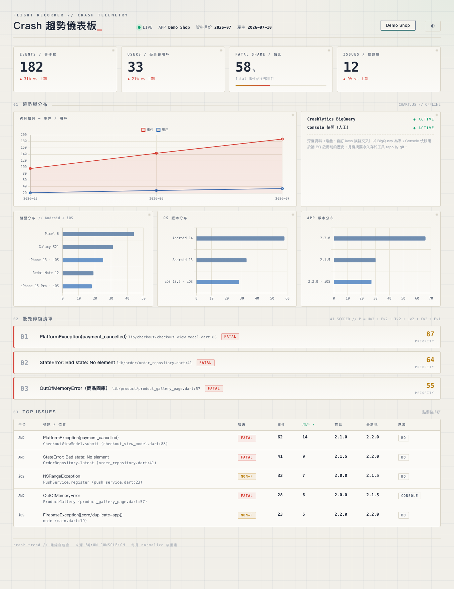

# crash-trend

**Firebase Crashlytics 趨勢分析引擎** — 匯出 crash 資料 → AI 找 top pattern（機型/OS/版本分布）→ 產出優先修復清單、月報，與一個離線可開的儀表板。設定驅動、多 app 共用一套腳本，換公司／換專案 10 分鐘上線。



## 它解決什麼問題

Crashlytics console 看得到 crash，但「這個月哪些 crash 最該先修？」「趨勢是好轉還是惡化？」「集中在哪些機型/版本？」需要人工整理。crash-trend 把這件事變成一條可排程的管道：

```
BigQuery export ──→ fetch ──→ normalize ──→ AI 分析（優先級評分）──→ 月報 md
（Spark 免費可用）                 │                                └→ Google Chat 卡片（可選）
                                  └────────→ dashboard.html（自包含、離線可開、多 app 分頁）
```

- **優先修復清單**：`P = 影響用戶×3 ＋ fatal×2 ＋ 新增/惡化×2 ＋ 最新版仍現×2 ＋ 核心路徑×3 ＋ 事件×1`（評分是確定性程式；AI 只負責 root cause 推測、修法建議與工作量估計，並附上從 stack trace 自動對映到的原始碼片段）
- **儀表板**：單一 HTML 檔、Chart.js 內嵌、零 CDN，雙擊即開；亮/暗雙主題；跨月趨勢、分布交叉、可排序 issue 表
- **週排程**：Docker（supercronic）或 launchd，完成後可發通知

## 快速開始

```bash
git clone https://github.com/qpalzm963/crash-trend && cd crash-trend
cp apps.example.yaml apps.yaml                 # 填你的 app（Firebase 專案 ID 等）
gcloud auth login                              # 有該專案 IAM 權限的帳號
scripts/create_sa.sh <firebase_project_id>     # 一鍵建唯讀 SA ＋金鑰
# Firebase Console → 專案設定 → Integrations → BigQuery → Link 勾 Crashlytics（唯一手動步驟）
printf 'GEMINI_API_KEY=...\n' > .env           # AI 分析用（Google AI Studio 取得）
docker compose up -d --build                   # 每週一 09:37（Asia/Taipei）自動同步
# 隔日首批資料落地後，手動跑一輪看結果：
docker compose run --rm crash-trend /bin/bash /app/scripts/weekly_sync.sh
open dashboard.html
```

不用 Docker 的話：`python3 -m venv .venv && .venv/bin/pip install -r requirements.txt`，排程用 `scripts/com.crash-trend.weekly-sync.plist.example`（launchd）。

## 資料來源與平台限制（查證過的事實）

| 事實 | 影響 |
|---|---|
| Crashlytics 沒有公開 REST API | 程式化匯出唯一管道＝BigQuery export |
| **Spark 免費方案可用 BigQuery sandbox** | 不用綁帳單就能全自動（每日批次、無串流、表 60 天過期——本工具每月落地摘要到 repo，不受影響） |
| 資料自「連結日」起累積，**不回填** | 啟用前的 console 歷史（保留 90 天）只能人工填 `manual/<app>/console_issues.csv`（一次性，格式見範本） |
| 連結動作本身無 CLI | 每個 Firebase 專案要在 Console 點一次 Link |

## 設定

所有環境差異收斂在三處，程式碼零改動：

| 檔案 | 內容 | 版控 |
|---|---|---|
| `apps.yaml` | 各 app 的 Firebase 專案、core_paths（評分加權）、custom_keys | 建議放你的私有 instance repo |
| `.env` | `GEMINI_API_KEY`、`GEMINI_MODEL`（預設 gemini-2.5-flash） | ✗ 永不 |
| `~/.config/crash-trend/sa.json` | BigQuery 唯讀 SA 金鑰（`create_sa.sh` 產生） | ✗ 永不（Docker 以 read-only 掛載，不進 image） |

**多公司使用模式**：本 repo 當 `upstream`（引擎），每家公司 fork/clone 成私有 instance repo 放自己的 `apps.yaml` 與月報；引擎更新 `git pull upstream main`。

## AI 分析

- **自動**（排程）：`analyze_gemini.py` — 空資料月份不呼叫 API；`custom_keys` 有埋的 app 會做族群交叉（例如「crash 是否集中在某種用戶角色」）
- **互動**：搭配 Claude Code 等 agent 直接讀 `out/<app>/unified.json` 做深度分析與現場修復

## 專案結構

```
crash_trend/
  fetch_bigquery.py    # BQ export 查詢（SA / ADC 雙模式）
  normalize.py         # 多來源 → 統一 schema ＋ 月度摘要
  analyze_gemini.py    # 評分（程式）＋ 註解（Gemini）→ 月報 md
  build_dashboard.py   # 自包含儀表板產生器
scripts/
  weekly_sync.sh       # 週同步（Docker/launchd 皆呼叫此腳本）
  create_sa.sh         # 一鍵建 BigQuery 唯讀 SA
```

## License

MIT
