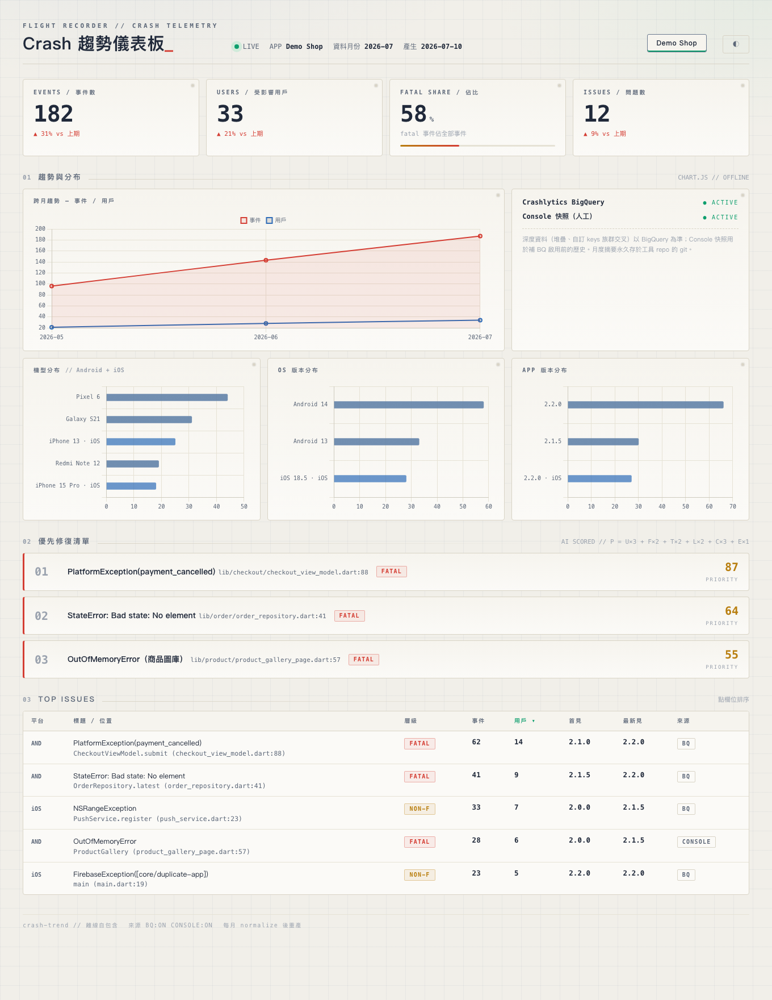

# crash-trend

**Firebase Crashlytics 趨勢分析與 SaaS 儀表板引擎 (Dashboard V2)** — 匯出 BigQuery 崩潰資料 ＋ Firebase Sessions 統計 ＋ MCP 堆疊追蹤 → AI 找 top pattern 與策略摘要 → 產出優先修復清單、月報，與自包含現代 SaaS 儀表板。設定驅動、多 App 共用一套腳本，換公司／換專案 10 分鐘上線。



## 它解決什麼問題

Crashlytics console 看得到個別 crash，但「哪些 crash 最該先修？」「整體 Crash-free 率與各版本健康度如何？」「集中在哪些機型/版本/用戶族群？」需要人工整理。crash-trend 把這件事變成一條自動化的現代化管線：

```
BigQuery Crashlytics ──┐
Firebase Sessions ─────┼→ fetch & enrich ─→ analyze_gemini (確定性評分 P0~P3 + AI 策略) ─→ dashboard.html
Crashlytics MCP / BQ ──┘                     └→ weekly_sync / surge alert / chat 卡片
```

### Dashboard V2 核心特色

- **現代 SaaS Analytics 風格**：淺色白底卡片設計、8 大功能分頁（總覽、問題列表、版本健康度、裝置分析、發佈版本、通知管線、AI 分析、系統設定）、響應式側邊欄與深淺色主題切換。
- **Crash-free 率與去重指標**：接入 Firebase Sessions 計算 Crash-free Users 與 Crash-free Sessions；期間去重 Affected Users；Sessions 未開啟時具備明確的 `Unavailable` 狀態，**絕不顯示假 0%**。
- **確定性 Priority Score ＋ Gemini AI 分析**：
  - 程式確定性評分：`P0` / `P1` / `P2` / `P3`（依受影響用戶、Fatal/ANR、惡化趨勢、最新版本影響、核心路徑權重加總）。
  - Gemini AI 策略摘要：首頁 AI Overview、Key Takeaways、推薦行動，以及各問題的 Root Cause 推測與具體修復建議。
- **元兇定位 (Blame Frame)**：解析關鍵元兇程式碼位置（檔案、行號、方法符號）與完整 Stack Trace，一鍵複製修復 Prompt 貼給 Coding Agent。
- **自包含與離線可用**：單一 HTML 檔、Chart.js 內嵌、零外部 CDN 依賴，`file://` 本地直接開啟。
- **多 App 無縫切換**：頂部 Header 支援多 App 下拉切換，URL 帶 `#<app>` 直達指定分頁。

---

## 快速開始

```bash
git clone https://github.com/qpalzm963/crash-trend && cd crash-trend
cp apps.example.yaml apps.yaml                 # 填寫你的 App 設定（Firebase 專案 ID、package 等）
gcloud auth login                              # 具備 GCP/Firebase 專案 IAM 權限的帳號
scripts/create_sa.sh <firebase_project_id>     # 一鍵建立唯讀 SA ＋ 金鑰
# Firebase Console → 專案設定 → Integrations → BigQuery → Link 勾 Crashlytics 與 Sessions
printf 'GEMINI_API_KEY=...\n' > .env           # AI 分析用（Google AI Studio 取得）
docker compose up -d --build                   # 每週三 10:00（Asia/Taipei）自動同步
# 手動試跑整條管線驗證：
docker compose run --rm crash-trend /bin/bash /app/scripts/weekly_sync.sh
open dashboard.html
```

不用 Docker 的話：
```bash
python3 -m venv .venv && .venv/bin/pip install -r requirements.txt
./scripts/weekly_sync.sh
open dashboard.html
```

---

## 設定檔架構

所有環境差異收斂在三處，核心程式碼零改動：

| 檔案 | 內容 | 版控 |
|---|---|---|
| `apps.yaml` | 各 App 的 Firebase 專案、BQ dataset、Sessions dataset、core_paths、custom_keys | 建議放私有 instance repo |
| `.env` | `GEMINI_API_KEY`、`GEMINI_MODEL`（預設 gemini-3.8-flash） | ✗ 永不進版控 |
| `~/.config/crash-trend/sa.json` | BigQuery 唯讀 SA 金鑰（`create_sa.sh` 產生） | ✗ 永不進版控（Docker read-only 掛載） |

### 多 App 設定與 Data Source Profile (`apps.yaml`)

系統正式支援 **Crashlytics-only** 與 **Full Sessions** 雙模式。若未開啟 Sessions 匯出，管線完全不打無效 API、不報 404，儀表板以 `未開啟` 清楚標註，其餘 Crash 除錯與 AI 優先級功能 100% 正常。

```yaml
credentials:
  bq_service_account: ~/.config/crash-trend/sa.json

apps:
  # 模式 A：Crashlytics-only 模式（推薦：輕量、零額外 Sessions 儲存成本）
  clock_in_app:
    display_name: MP打卡系統
    firebase_project: mp-clockin-44dee
    data_sources:
      crashlytics_bigquery: true          # 啟用 Crashlytics 匯出
      sessions: false                     # 停用 Sessions 查詢（不需 firebase_sessions 表）
      mcp: optional                       # optional 備援
    bq_dataset: firebase_crashlytics
    package_name: com.mp.clockinapp
    bundle_id: com.mp.clockin
    source_repo: ~/develop/clock_in_app
    platforms: [android, ios]
    core_paths: [auth_repository, punch, clock_in]

  # 模式 B：完整模式 (含 Firebase Sessions 計算 Crash-free %)
  shop_app:
    display_name: 購物商城 App
    firebase_project: shop-prod-12345
    data_sources:
      crashlytics_bigquery: true
      sessions: true                      # 啟用 Sessions 查詢計算 Crash-free 率
    bq_dataset: firebase_crashlytics
    sessions_dataset: firebase_sessions
    package_name: com.example.shop
    source_repo: ~/develop/shop_app
    platforms: [android, ios]
    core_paths: [checkout, payment, CartActivity]
    custom_keys: [user_tier, network_type]
### 3. MCP 補強策略 (MCP Refresh Strategy)

Firebase Crashlytics MCP 為**可選補強資料源**，主要用於補充 BigQuery 缺失之完整堆疊、Blame frame、Breadcrumbs 與 Logs。

| 模式 (`mcp.mode`) | 行為說明 | 適用情境 |
| :--- | :--- | :--- |
| **`manual`** *(預設)* | 排程完全不發送 MCP 請求，由開發者本機手動執行指令刷新快取至 `out/<app>/stacktraces.json` | 避免 CI/伺服器無登入態或 quota 限制 |
| **`weekly`** | `weekly_sync.sh` 自動檢查快取是否超過 `max_age_days`（預設 7 天），過期才嘗試刷新；**MCP 失敗絕不中斷管線** | 本機排程且有固定 `firebase login` 授權 |
| **`off`** | 完全停用 MCP，純靠 BigQuery 欄位與堆疊啟發式解析 | 不需要 MCP 或完全離線環境 |

**前置需求與手動指令**：
```bash
# 1. 確保安裝最新版 Firebase CLI 並登入
npm i -g firebase-tools@latest
firebase login

# 2. 手動刷新特定 App 之 MCP 快取 (manual 模式)
python3 crash_trend/fetch_stacktraces.py --app clock_in_app
```

> [!NOTE]
> Firebase Crashlytics MCP 依賴 `firebase login` 之使用者權限；GCP 服務帳號（Service Account）呼叫未公開之 Crashlytics v1alpha API 一律會回傳 404。因此 MCP 嚴格定位為選配補強，BigQuery 已有之完整資訊絕不會被 MCP 覆蓋。

### 4. 管線健康度與來源新鮮度 (Pipeline Health & Source Health - V2.2)

- **結構化執行摘要 (`out/pipeline_run.json`)**：每次排程或手動執行，自動記錄各 App、各 Stage 的狀態 (`success` / `failed` / `skipped` / `disabled` / `degraded`)、精確耗時與**經過敏感憑證消毒 (Credential Sanitization)** 之錯誤原因。
- **儀表板來源健康度資訊卡**：總覽頁面直觀展示 BigQuery、Sessions、MCP、AI 之即時連線健康度與相對時間新鮮度（例如 `2 小時前`、`9 天前`、`本次同步`）；MCP 過期自動備註使用備用快取中，Sessions 停用明確標示 `未開啟`。

### 5. AI 執行期治理與雙層生產路由 (AI Runtime & Routing - V2.5)

系統支援雙層架構生產路由與嚴格零費用防護（Cost Guard）：

| 功能領域 | 實作機制 | 說明 |
| :--- | :--- | :--- |
| **預設模型升級 (#38)** | `gemini-3.8-flash` | Direct Gemini 升級至 2026-09 最新 GA 模型，支援高思考深度，自動省略過時 temperature 參數。 |
| **原生 JSON Schema (#39)** | `responseJsonSchema` | Gemini 與 OpenRouter 全面對齊單一 Canonical JSON Schema 契約，無 lossy schema rewrite。 |
| **生產輕量路由 (#40)** | `auto` 雙工模式 | 輕量任務（Issue Triage、分類、摘要、打標）由 OpenRouter Free Worker 承接；深度診斷保留給 Gemini Direct。 |
| **後台 Policy 治理 (#41)** | `ai_config_service.py` | 支援 `auto` / `gemini_only` / `openrouter_only` 安全切換；`allow_paid_models=false` 嚴格阻擋付費模型。 |
| **使用量與配額觀測 (#42)** | `ai_telemetry.py` | 記錄近 7 天請求量、成功率、429 Rate Limit、備援次數；嚴格審計真實 Token 數據，不假造估算。 |

**AI Policy 管理 CLI 指令範例**：
```bash
# 查看當前 Effective Policy (全域或指定 App)
python3 -m crash_trend.ai_config_service --app clock_in_app --show

# 切換路由模式 (auto / gemini_only / openrouter_only)
python3 -m crash_trend.ai_config_service --app clock_in_app --mode auto

# 重置特定 App 回全域預設 Policy
python3 -m crash_trend.ai_config_service --app clock_in_app --reset
```

---

## 專案結構

```
crash_trend/
  schema_v2.py           # Dashboard V2 資料契約 (TypedDicts) 與嚴格驗證器
  pipeline_health.py     # Pipeline Health：Run Summary、Stage 狀態、敏感資訊消毒
  pipeline_run.py        # 端到端管線驅動器（排程與 CLI 進入點）
  ai_provider.py         # AI Provider 實作 (Gemini Direct 與 OpenRouter，共享 Canonical JSON Schema)
  ai_router.py           # AITaskRouter 任務分類、動態路由、Free Guard 與自動備援
  ai_config_service.py   # AI Policy Admin 後台治理、安全更新與 CLI 管理工具
  ai_telemetry.py        # AI Usage & Quota Observability 使用量審計與統計引擎
  fetch_bigquery.py      # BigQuery V2：Overview 聚合、日曆日每日趨勢、維度分布
  fetch_sessions.py      # Firebase Sessions：Crash-free Users / Sessions 指標與版本健康度
  fetch_issue_details.py # Issue Detail：Stack trace、Blame frame、Breadcrumbs、Logs (含 MCP fallback)
  fetch_stacktraces.py   # Firebase MCP 驅動客戶端 (headless stdio JSON-RPC)
  analyze_gemini.py      # 確定性 Priority Score ＋ AI 雙層分析 (Triage + Deep Analysis)
  build_dashboard.py     # 多 App 聚合與自包含 SaaS Dashboard HTML 產生器
  check_surge.py         # 每日趨勢週暴增偵測告警
  pm_brief.py            # 優先 issue → 給 PM 的白話簡報
  post_report.py         # 月度摘要卡發送（聊天整合，可選）
  config.py              # apps.yaml 讀取與路徑工具
scripts/
  weekly_sync.sh         # 週同步主要排程入口（整合 pipeline_run.py）
  create_sa.sh           # GCP 服務帳號一鍵建立
  export_from_bq.py      # 手動單次 query dump 工具
tests/                   # 單元測試、E2E 契約測試與測試夾具
```

