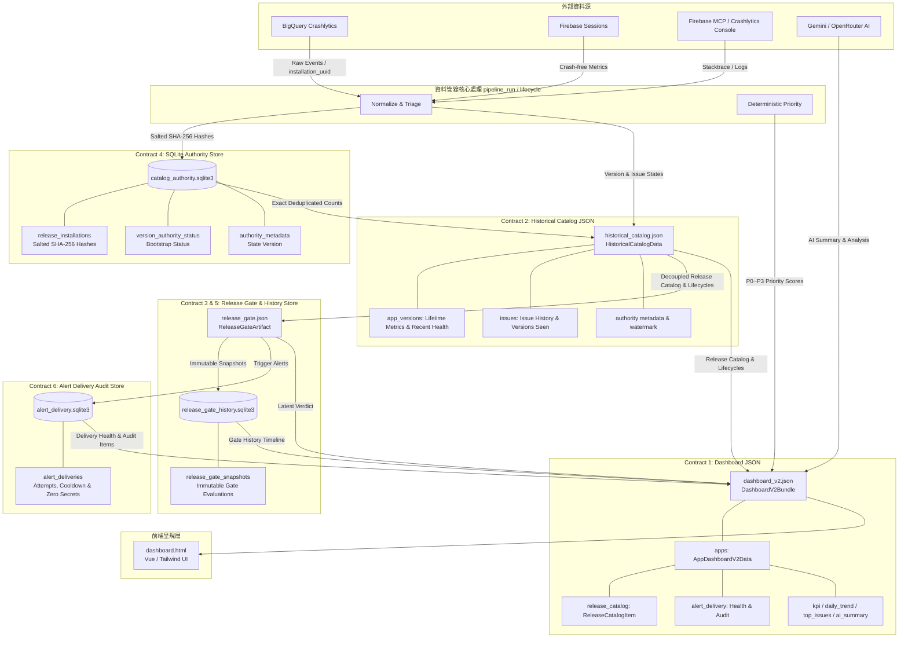
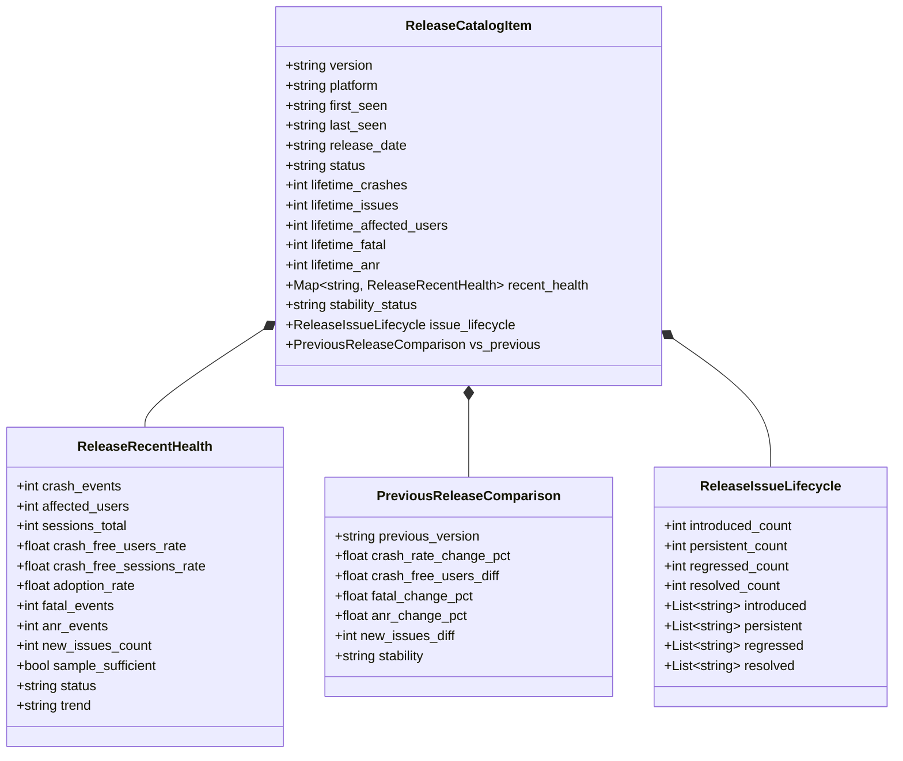

# Dashboard V2.7 Data Schema & Contracts Specification

本文檔定義 **Crashlytics Engineering Dashboard V2.7** 的完整資料契約體系（Data Contracts）。
本契約旨在徹底解耦資料擷取（BigQuery、Firebase Sessions、MCP、Console）、去重權威儲存（SQLite）、跨視窗歷史目錄（Historical Catalog）、版本退化閘門（Release Regression Gate）、品質通知傳送與觀測度（Alerts & Observability）、AI 策略分析與前端 UI 呈現層，使系統各層級能以標準化、強型別、具備確定性與隱私保護的介面獨立演進。

---

## 1. 設計原則與核心概念

1. **六大契約職責分離（Six Distinct Decoupled Contracts）**：
   系統嚴格劃分六種獨立且單向流動的資料契約：
    - **Dashboard JSON Contract** (`out/dashboard_v2.json` 或 `out/<app>/dashboard_v2.json`)：專供前端 Web UI 呈現的聚合容器（Bundle）。
    - **Historical Catalog JSON Contract** (`out/<app>/historical_catalog.json`)：跨視窗版本演進與 Issue 生命週期累積狀態。
    - **Release Gate Artifact JSON Contract** (`out/<app>/release_gate.json`)：單次最新版本品質退化閘門評估結果之 CI 機器可讀產物。
    - **Catalog Authority SQLite Contract** (`out/<app>/catalog_authority.sqlite3`)：設備級精確去重的唯一事實來源（Single Source of Truth）。
    - **Release Gate History SQLite Contract** (`out/<app>/release_gate_history.sqlite3`)：版本退化閘門歷史評估快照與演進趨勢之不可變儲存庫。
    - **Alert Delivery Audit SQLite Contract** (`out/<app>/alert_delivery.sqlite3`)：品質通知投遞狀態、去重冷卻、重試與健康度審計之儲存庫。
2. **前端與 Raw BigQuery 完全解耦**：
   UI 僅消費本 Schema 定義的聚合資料與結構化分析，不得直接解析 BigQuery raw JSON 或自行在前端執行重度聚合。
3. **精確去重與隱私防護（Privacy-Preserving Deterministic Salted Hashing & Zero PII）**：
   - 設備識別碼（`installation_uuid`）在進入權威資料庫前，一律以 `app_id` 作為 Salt 進行 SHA-256 確定性加鹽雜湊（`SHA-256(f"{app_id}:{raw_uuid}")`），資料庫內不儲存任何明文 PII。
   - **JSON 持久化禁止條款**：`historical_catalog.json` 與 `dashboard_v2.json` **嚴禁儲存任何 raw `installation_ids` 或 `user_ids` 清單**，徹底避免 JSON 檔案膨脹與記憶體外溢。
4. **多 App 與跨平台（Multi-App & Cross-Platform 一等支援）**：
   原生支援包含 iOS / Android 雙平台或多 App 切換，版本與問題追蹤嚴格依平台隔離，禁止不同平台的同名版本相互污染。
5. **正確的聚合語意與資料一致性（Accurate Aggregations & Consistency）**：
   - `crash_events`：期間內所有崩潰事件全量統計（`COUNT(*)`）。
   - `affected_users`：期間內去重受影響用戶（`COUNT(DISTINCT installation_uuid)`），**禁止跨 Issue 加總造成重複計數**。
   - `daily_trend` 一致性：`sum(daily_trend[i].crash_events) == kpi.crash_events.value`；`daily_trend[i].fatal_events + daily_trend[i].anr_events + daily_trend[i].non_fatal_events == daily_trend[i].crash_events`。
   - `affected_users` 在 daily trend 中為當日 distinct users，各日相加可能大於期間總 distinct users（正常現象）。
6. **顯式狀態與空值語意（Explicit Availability Semantics）**：
   對外部依賴（如 Firebase Sessions 導出、AI 策略分析）提供顯式的 `status`（`available` / `unavailable` / `disabled` / `error` / `stale` / `insufficient_data`）。當 Sessions 未啟用時，Crash-free 指標呈現 `unavailable`，**嚴禁顯示假 0% 或假 0**。
7. **嚴格時間戳與版本號規範（Strict ISO 8601 UTC Timestamps & Authoritative Dates）**：
   所有時間戳一律使用標準 **ISO 8601 UTC** 字串（例：`2026-09-02T14:30:00Z`），必須以 `Z` 或 `+00:00` 結尾。版本發布日期 `release_date` 為權威日期，**嚴禁 fallback 至 `first_seen` 時間戳**。
8. **冪等性與增量水線（Idempotency & Watermark Synchronization）**：
   透過事件時間戳水線（`watermark`）與 SQLite `INSERT OR IGNORE` 實現冪等追加寫入，保證重複執行管線不產生資料偏差。
9. **確定性版本退化判定與不可變歷史快照（Deterministic Gating & Immutable Snapshots）**：
   Release Gate 以正規化暴險指標（Normalized Exposure Rates）為基準進行客觀評估，評估結果保存為不可變快照寫入 SQLite，保證歷史重播與重試之完全冪等性。
10. **告警投遞觀測性與零機密洩漏原則（Alert Observability & Zero Secret Storage）**：
   Webhook URLs、Token、密鑰、認證標頭（`Bearer`, `Basic`, `ApiKey`, `Digest`）與 Raw UUID 徹底抹除，絕不持久化至資料庫或進入前端投影。
11. **唯讀環境安全相容性（Read-only Safe Observability）**：
   Dashboard 建置與 CLI 查詢以 SQLite URI 唯讀模式連線（`mode=ro`），在唯讀掛載/`chmod 444` 環境下保證零 DDL 變更與零 WAL 寫入副檔副作用。

---

## 2. 資料契約架構與系統邊界



### 六大契約特性對比矩陣

| 特性維度 | 1. Dashboard JSON | 2. Historical Catalog | 3. Release Gate Artifact | 4. Authority Store | 5. Gate History Store | 6. Alert Delivery Store |
| :--- | :--- | :--- | :--- | :--- | :--- | :--- |
| **檔案路徑** | `out/dashboard_v2.json` 或 `out/<app>/dashboard_v2.json` | `out/<app>/historical_catalog.json` | `out/<app>/release_gate.json` | `out/<app>/catalog_authority.sqlite3` | `out/<app>/release_gate_history.sqlite3` | `out/<app>/alert_delivery.sqlite3` |
| **主要定位** | 前端呈現容器（Bundle） | 跨視窗版本演進與狀態累積 | 版本退化判定機器產物 | 精確去重事實來源（SSOT） | 閘門評估不可變歷史序列 | 發送嘗試、去重冷卻與審計 |
| **儲存引擎** | 純 JSON 檔案 | 純 JSON 檔案 | 純 JSON 檔案 | SQLite 3（WAL 模式） | SQLite 3（WAL 模式） | SQLite 3（WAL 模式） |
| **Schema 版本** | `2.8.0`（相容 `2.0` ~ `2.8.0`） | Producer: `2.3.0` | `1.0` | `state_version: 1` | `schema_version: 1` | `schema_version: 1` |
| **PII / 機密安全**| **零 Raw IDs & 零機密** | **零 Raw IDs** | **零 Raw IDs & 零機密** | **加鹽雜湊集合** (SHA-256) | **零 Raw IDs & 零機密** | **全 Scheme 脫敏 & 零 Raw IDs** |
| **讀寫模式** | 每次 Pipeline Run 全量產出 | 每次 Pipeline Run 增量讀取寫回 | 每次 Gate 評估全量寫入 | 水線批次追加 (`INSERT OR IGNORE`) | 評估完成冪等寫入 | 發送/抑制時追加寫入，唯讀查詢 |
| **生命週期行為**| 單次消費 / UI 渲染 | 跨週期持久化、水線推進 | 單次評估 / CI 判定依據 | 跨週期持久化、去重計算 | 跨週期不可變歷史快照 | 跨週期審計與 24h 健康度統計 |

---

## 3. 契約一：Dashboard JSON 規格（`out/dashboard_v2.json`, `out/<app>/dashboard_v2.json`）

### 3.1 容器與 Metadata

#### `DashboardV2Bundle`
前端載入或 static dashboard 內嵌之頂層容器：
| 欄位名稱 | 型別 | 必填 | 說明 | 範例 |
| :--- | :--- | :--- | :--- | :--- |
| `schema_version` | string | 是 | Schema 版本號，當前為 `"2.8.0"`（相容 `"2.0"`, `"2.3"`, `"2.3.0"`, `"2.6"`, `"2.6.0"`, `"2.7"`, `"2.7.0"`, `"2.8"`, `"2.8.0"`） | `"2.8.0"` |
| `generated_at` | string (ISO 8601 UTC) | 是 | 報表產生時間（UTC，結尾必須為 `Z`） | `"2026-09-02T14:00:00Z"` |
| `default_app` | string | 是 | 預設開啟的 App key（必須存在於 `apps` 鍵值中） | `"my_app"` |
| `apps` | object | 是 | Key 為 app ID，Value 為 `AppDashboardV2Data` | `{ "my_app": { ... } }` |
| `pipeline_run` | object \| null | 否 | 最近一次管線執行健康度與 stage 審計資訊 | 見 `out/pipeline_run.json` |
| `global_ai_policy` | object \| null | 否 | 全域 AI 治理原則（routing mode, primary/lightweight 模型） | `{ "mode": "auto" }` |
| `ai_usage` | object \| null | 否 | AI Token 與配額審計資訊 | `{ "total_tokens": 12500 }` |

#### `AppDashboardV2Data`
單一 App 完整資料核心：
| 欄位名稱 | 型別 | 必填 | 說明 | 範例 |
| :--- | :--- | :--- | :--- | :--- |
| `metadata` | AppMetadata | 是 | 應用程式基礎資訊 | 見下方 `AppMetadata` |
| `period` | PeriodInfo | 是 | 當前主視窗統計時間區間（如 30 天） | 見下方 `PeriodInfo` |
| `sources` | SourcesAvailability | 是 | 外部資料源抓取健康度與狀態 | 見下方 `SourcesAvailability` |
| `kpi` | OverviewKPI | 是 | 核心 KPI 匯總 | 見下方 `OverviewKPI` |
| `daily_trend` | array[DailyTrendPoint] | 是 | 每日趨勢序列（依日期升冪排序） | 見下方 `DailyTrendPoint` |
| `version_health` | array[VersionHealthItem]| 是 | 當期活躍版本之健康度列表 | 見下方 `VersionHealthItem` |
| `distributions` | Distributions | 是 | 維度分布統計（平台、裝置、OS、版本） | 見下方 `Distributions` |
| `top_issues` | array[IssueSummary] | 是 | Top Issue 清單（含優先級與 AI 分析） | 見下方 `IssueSummary` |
| `ai_summary` | AISummary | 是 | 整體健康度 AI 策略摘要報告 | 見下方 `AISummary` |
| `limitations` | array[string] | 是 | 資料限制或邊界說明字串陣列 | `["Sessions 僅收集近 30 天"]` |
| `periods` | object \| null | 否 | 多週期權威快照字典（Key 為天數 `"7"`, `"30"`, `"90"`） | 見下方 `AppPeriodSnapshot` |
| `ai_policy` | object \| null | 否 | 該 App 專屬之 AI Policy 覆寫設定 | `{ "mode": "gemini_only" }` |
| `release_catalog` | array[ReleaseCatalogItem] \| null | 否 | 獨立於單期快照之長期持續版本目錄 | 見第 3.9 節 `ReleaseCatalogItem` |
| `alert_delivery` | AlertDeliveryAppData \| null | 否 | Google Chat 品質警報發送健康度與最近審計記錄 | 見第 3.12 節 `AlertDeliveryAppData` |

#### `AppMetadata`
| 欄位名稱 | 型別 | 必填 | 說明 | 範例 |
| :--- | :--- | :--- | :--- | :--- |
| `app_id` | string | 是 | 系統識別用唯一代號 | `"my_app"` |
| `display_name` | string | 是 | UI 顯示名稱 | `"My App (Taiwan)"` |
| `firebase_project_id` | string | 是 | Firebase 專案代碼 | `"my-app-prod-1234"` |
| `platforms` | array[string] | 是 | 支援之平台列表（`"ios"`, `"android"`） | `["ios", "android"]` |
| `source_repo` | string \| null | 是 (可為 null) | 本地/遠端原始碼路徑或 Git 網址 | `"~/projects/my_app"` |
| `custom_keys_monitored`| array[string] | 是 | 監控中自訂鍵值列表 | `["user_tier", "screen_name"]` |

#### `PeriodInfo`
| 欄位名稱 | 型別 | 必填 | 說明 | 範例 |
| :--- | :--- | :--- | :--- | :--- |
| `days` | integer | 是 | 統計回溯天數 | `30` |
| `start_time` | string (ISO 8601 UTC) | 是 | 區間開始時間（UTC，結尾必須為 `Z`） | `"2026-08-03T14:00:00Z"` |
| `end_time` | string (ISO 8601 UTC) | 是 | 區間結束時間（UTC，結尾必須為 `Z`） | `"2026-09-02T14:00:00Z"` |
| `comparison_period` | object \| null | 是 (可為 null) | 上期對比時間範圍資訊 | `{ "days": 30, "start_time": "...", "end_time": "..." }` |

---

### 3.2 資料來源狀態（Sources & Availability）

#### `SourcesAvailability`
記錄各外部數據管道的健康度與抓取狀態：
```json
{
  "crashlytics_bq": {
    "status": "available",
    "tables_queried": ["com_example_app_IOS", "com_example_app_ANDROID"],
    "last_sync_timestamp": "2026-09-02T14:00:00Z",
    "error_message": null
  },
  "firebase_sessions": {
    "status": "unavailable",
    "last_sync_timestamp": null,
    "error_message": "Firebase Sessions export table not found in dataset"
  },
  "mcp_crashlytics": {
    "status": "available",
    "last_sync_timestamp": "2026-09-02T14:05:00Z",
    "error_message": null
  },
  "ai": {
    "status": "available",
    "provider": "gemini",
    "model": "gemini-3.8-flash",
    "requested_mode": "auto",
    "task_type": "deep_analysis",
    "selected_provider": "gemini",
    "selected_model": "gemini-3.8-flash",
    "routing_reason": "high_priority_issue",
    "fallback_used": false,
    "fallback_reason": null,
    "paid_model_allowed": false,
    "last_sync_timestamp": "2026-09-02T14:10:00Z",
    "error_message": null
  },
  "historical_catalog": {
    "status": "available",
    "last_sync_timestamp": "2026-09-02T14:00:00Z",
    "error_message": null
  }
}
```
- `status` 取值：`"available"`（正常可用）、`"unavailable"`（未啟用/無數據）、`"disabled"`（手動關閉/未開啟）、`"error"`（查詢失敗）、`"stale"`（快取過期/使用備用快取中）、`"insufficient_data"`（資料量不足以計算）。
- 支援相容欄位：`gemini_ai`、`manual_console`。
- 可選全域欄位：`bundle.pipeline_run` 記錄管線健康狀態 (`out/pipeline_run.json`)。

---

### 3.3 總覽 KPI（Overview KPI）

#### `KPIMetric`（通用數值指標）
| 欄位名稱 | 型別 | 必填 | 說明 | 範例 |
| :--- | :--- | :--- | :--- | :--- |
| `value` | integer | 是 | 當期計數 | `12450` |
| `previous_value` | integer \| null | 是 (可為 null) | 上期計數（無基期則為 `null`） | `15600` |
| `change_pct` | float \| null | 是 (可為 null) | 變化百分比（%）（例：-20.19 代表下降 20.19%） | `-20.19` |
| `status` | string | 是 | 狀態（`"available"`, `"insufficient_data"`, `"error"`） | `"available"` |

#### `CrashFreeMetric`（Crash-free 率指標，由 Firebase Sessions 提供）
| 欄位名稱 | 型別 | 必填 | 說明 | 範例 |
| :--- | :--- | :--- | :--- | :--- |
| `rate` | float \| null | 是 (可為 null) | Crash-free 比率（**0.0 ～ 1.0**，例如 0.9985 代表 99.85%） | `0.9985` |
| `total` | integer \| null | 是 (可為 null) | 總數（總用戶數或總 Session 數） | `500000` |
| `crashed` | integer \| null | 是 (可為 null) | 崩潰數（崩潰用戶數或崩潰 Session 數） | `750` |
| `previous_rate` | float \| null | 是 (可為 null) | 上期 Crash-free 比率 | `0.9972` |
| `change_pct_points`| float \| null | 是 (可為 null) | 百分點變化（例：`+0.13` 代表提高 0.13%） | `0.13` |
| `status` | string | 是 | `"available"` \| `"unavailable"` \| `"insufficient_data"` \| `"error"` | `"available"` |
| `unavailable_reason` | string \| null | 是 (可為 null) | 若為 `unavailable` 時的原因說明 | `"Firebase Sessions export 未開啟"` |

#### `EventsByErrorType`
| 欄位名稱 | 型別 | 必填 | 說明 | 範例 |
| :--- | :--- | :--- | :--- | :--- |
| `fatal` | integer | 是 | 致命閃退（FATAL）事件數 | `8200` |
| `anr` | integer | 是 | 應用程式無回應（ANR）事件數 | `1350` |
| `non_fatal` | integer | 是 | 捕捉記錄之非致命錯誤事件數 | `2900` |

---

### 3.4 每日趨勢（Daily Trend）

`daily_trend` 為陣列，依日期由舊至新升冪排序（`date: YYYY-MM-DD`），天數長度應涵蓋 `period.days`。
```json
{
  "date": "2026-09-01",
  "crash_events": 412,
  "affected_users": 285,
  "fatal_events": 270,
  "anr_events": 42,
  "non_fatal_events": 100,
  "sessions_total": 24500,
  "crashed_sessions": 38,
  "crash_free_sessions_rate": 0.9984,
  "by_platform": {
    "ios": { "events": 180, "users": 120 },
    "android": { "events": 232, "users": 165 }
  }
}
```

---

### 3.5 版本健康度（Version Health）

`version_health` 陣列呈現各主要活躍版本的指標，按版本號降冪或活躍度排序：
| 欄位名稱 | 型別 | 必填 | 說明 | 範例 |
| :--- | :--- | :--- | :--- | :--- |
| `version` | string | 是 | 應用程式版本字串 | `"3.2.0"` |
| `platform` | string | 是 | `"ios"` \| `"android"` \| `"all"` | `"all"` |
| `release_date` | string \| null | 是 (可為 null) | 發布日期（YYYY-MM-DD） | `"2026-08-20"` |
| `crash_events` | integer | 是 | 該版本在此期間的崩潰事件數 | `1250` |
| `affected_users` | integer | 是 | 該版本在此期間受影響用戶數 | `820` |
| `crash_free_users_rate` | float \| null | 是 (可為 null) | 該版本 Crash-free 用戶率（若有 Sessions） | `0.9991` |
| `crash_free_sessions_rate`| float \| null | 是 (可為 null) | 該版本 Crash-free Sessions 率 | `0.9994` |
| `adoption_rate` | float \| null | 是 (可為 null) | 該版本佔總活躍 Session / User 佔比（0.0～1.0） | `0.65` |
| `status` | string | 是 | `"latest"` \| `"active"` \| `"maintenance"` \| `"deprecated"` | `"latest"` |
| `trend` | string | 是 | `"improving"` \| `"degrading"` \| `"stable"` \| `"new"` | `"stable"` |

---

### 3.6 維度分布（Distributions）

```json
{
  "platform": [
    { "name": "android", "events": 7200, "users": 4800, "share": 0.578 },
    { "name": "ios", "events": 5250, "users": 3500, "share": 0.422 }
  ],
  "device_models": [
    { "model": "iPhone 15 Pro", "platform": "ios", "events": 1200, "users": 800, "share": 0.096 },
    { "model": "Samsung Galaxy S24", "platform": "android", "events": 980, "users": 650, "share": 0.078 }
  ],
  "os_versions": [
    { "os_version": "iOS 18.0.1", "platform": "ios", "events": 3100, "users": 2100, "share": 0.249 },
    { "os_version": "Android 14", "platform": "android", "events": 4500, "users": 3000, "share": 0.361 }
  ],
  "app_versions": [
    { "app_version": "3.2.0", "platform": "all", "events": 6800, "users": 4300, "share": 0.546 },
    { "app_version": "3.1.2", "platform": "all", "events": 4100, "users": 2800, "share": 0.329 }
  ],
  "custom_keys": [
    { "key": "user_tier", "value": "vip", "platform": "all", "events": 3200 }
  ]
}
```

---

### 3.7 Top Issues 與 Issue Detail

#### `IssueSummary`
| 欄位名稱 | 型別 | 必填 | 說明 | 範例 |
| :--- | :--- | :--- | :--- | :--- |
| `issue_id` | string | 是 | Crashlytics Issue ID | `"8a7f1b2c"` |
| `platform` | string | 是 | `"ios"` \| `"android"` | `"android"` |
| `title` | string | 是 | 錯誤類型或崩潰主標題 | `"NullPointerException"` |
| `subtitle` | string | 是 | 發生位置描述或函式 | `"CheckoutActivity.kt:142"` |
| `error_type` | string | 是 | `"FATAL"` \| `"ANR"` \| `"NON_FATAL"` | `"FATAL"` |
| `priority` | PriorityInfo | 是 | 程式計算之優先級分數與等級 | 見下方 `PriorityInfo` |
| `events` | integer | 是 | 該 Issue 在期間內之事件總數 | `3420` |
| `affected_users` | integer | 是 | 該 Issue 在期間內受影響之用戶數 | `2100` |
| `first_seen_timestamp` | string (ISO 8601 UTC) | 是 | 該 Issue 首次出現時間戳（結尾 `Z`） | `"2026-08-12T09:15:00Z"` |
| `last_seen_timestamp` | string (ISO 8601 UTC) | 是 | 該 Issue 最近出現時間戳（結尾 `Z`） | `"2026-09-02T13:40:00Z"` |
| `first_seen_version` | string | 是 | 該 Issue 最早出現之版本 | `"3.1.0"` |
| `last_seen_version` | string | 是 | 該 Issue 最新出現之版本 | `"3.2.0"` |
| `version_distribution` | array[object] | 是 | 依版本細分之 events/users 列表 | `[{"version":"3.2.0","events":2800,"users":1700}]` |
| `blame_frame` | BlameFrame \| null | 是 (可為 null) | 元兇 Stack Frame 資訊 | 見下方 `BlameFrame` |
| `ai_analysis` | AIIssueAnalysis | 是 | AI 針對該 Issue 之分析摘要 | 見下方 `AIIssueAnalysis` |
| `detail` | IssueDetail \| null | 是 (可為 null) | 深度診斷資料（若有抓取） | 見下方 `IssueDetail` |
| `lifecycle` | IssueLifecycle \| null | 否 (V2.3+ 規範) | 跨版本生命週期狀態 | 見下方 `IssueLifecycle` |
| `occurrence_timeline` | IssueOccurrenceSummary \| null | 否 (V2.8+ 規範) | 每日發生趨勢、首末發生日期與版本切換 | 見下方 `IssueOccurrenceSummary` |

#### `PriorityInfo`
```json
{
  "score": 88,
  "level": "P0",
  "trend": "worsening",
  "score_breakdown": {
    "users_normalized": 10.0,
    "events_normalized": 8.5,
    "fatal_anr_boost": 2,
    "worsening_boost": 2,
    "latest_version_boost": 2,
    "core_path_boost": 3
  }
}
```

#### `BlameFrame`
```json
{
  "file": "app/src/main/java/com/example/CheckoutActivity.kt",
  "line": 142,
  "symbol": "com.example.CheckoutActivity.processPayment",
  "class_name": "com.example.CheckoutActivity",
  "method_name": "processPayment",
  "is_blame": true,
  "source_available": true
}
```

#### `AIIssueAnalysis`
```json
{
  "status": "available",
  "root_cause": "結帳流程中 userProfile 在特定網路延遲條件下尚未初始化即被呼叫導致 NPE。",
  "suggested_fix": "在呼叫 processPayment 前加入 profile 空值防護並補齊 fallback 提示。",
  "effort": "S",
  "confidence": "high",
  "reasoning_sources": ["stack_trace", "blame_frame", "version_concentration"]
}
```

#### `IssueDetail`
```json
{
  "stack_trace": "java.lang.NullPointerException: Attempt to invoke virtual method on a null object reference\n\tat com.example.CheckoutActivity.processPayment(CheckoutActivity.kt:142)\n\tat ...",
  "breadcrumbs": [
    {
      "timestamp": "2026-09-02T13:39:58Z",
      "category": "navigation",
      "message": "User entered /checkout",
      "level": "info"
    }
  ],
  "logs": [
    { "timestamp": "2026-09-02T13:39:59Z", "message": "[PaymentService] Initiating payment request" }
  ],
  "custom_keys": {
    "user_tier": "gold",
    "cart_items_count": 3
  },
  "top_devices": [
    { "model": "Pixel 8", "events": 1400 }
  ],
  "top_os": [
    { "os_version": "Android 14", "events": 2300 }
  ]
}
```

#### `IssueLifecycle`
跨版本生命週期追蹤資訊（V2.3+ 支援）：
```json
{
  "status": "regressed",
  "latest_version": "3.2.0",
  "first_seen_version": "3.0.0",
  "last_seen_version": "3.2.0",
  "versions_seen": 2,
  "confidence": "high",
  "previously_absent_since": "3.1.0",
  "reappeared_version": "3.2.0",
  "reason": "Absent in 3.1.0 (sample sufficient) and reappeared in 3.2.0"
}
```
| 欄位名稱 | 型別 | 必填 | 說明 | 範例 |
| :--- | :--- | :--- | :--- | :--- |
| `status` | string | 是 | `"new_in_latest"` \| `"persistent"` \| `"regressed"` \| `"resolved"` \| `"not_observed_latest"` | `"regressed"` |
| `latest_version` | string | 是 | 當前最新發布版本 | `"3.2.0"` |
| `first_seen_version` | string | 是 | 該 Issue 最早出現之版本 | `"3.0.0"` |
| `last_seen_version` | string | 是 | 該 Issue 最新出現之版本 | `"3.2.0"` |
| `versions_seen` | integer | 是 | 該 Issue 在歷史上活躍之版本總數（非負整數） | `2` |
| `confidence` | string | 是 | 判定信賴等級：`"high"` \| `"medium"` \| `"low"` | `"high"` |
| `previously_absent_since`| string \| null | 否 | 若為 `regressed`，前次消失之版本 | `"3.1.0"` |
| `reappeared_version` | string \| null | 否 | 若為 `regressed`，再次復發之版本 | `"3.2.0"` |
| `reason` | string \| null | 否 | 生命週期狀態判定之依據說明 | `"Absent in 3.1.0..."` |

---

### 3.8 AI 策略摘要（AI Summary）

```json
{
  "status": "available",
  "provider": "gemini",
  "model": "gemini-3.8-flash",
  "generated_at": "2026-09-02T14:10:00Z",
  "overview": "本期整體閃退事件較上月下降 20.2%，然而 3.2.0 新版在結帳流程中引入 1 個高頻 P0 NPE 崩潰，影響約 2,100 位用戶。",
  "key_takeaways": [
    "P0: CheckoutActivity.kt:142 佔本期總閃退量 27.5%，建議立即發布 3.2.1 Hotfix",
    "Android 14 上的 ANR 集中在啟動階段 Database init，需評估非同步載入",
    "舊版本（< 3.1.0）崩潰持續收斂，整體 Crash-free rate 提升至 99.85%"
  ],
  "distribution_insights": "崩潰高度集中於 Android 平台（佔 58%）及 3.2.0 版本。iOS 平台表現穩定。",
  "recommended_actions": [
    { "priority": "P0", "issue_id": "8a7f1b2c", "action": "修復 CheckoutActivity 空值指標保護", "effort": "S" }
  ],
  "data_limitations": "Firebase Sessions 僅收集最近 30 天數據；部分 MCP stack trace 缺去符號化資訊。"
}
```

---

### 3.9 持續版本目錄契約（Release Catalog Specification）

Release Catalog（`release_catalog`）是 Dashboard V2.6 核心功能，將版本狀態由單期視窗提升為獨立發布實體。



#### `ReleaseCatalogItem` 欄位定義
| 欄位名稱 | 型別 | 必填 | 說明 | 範例 |
| :--- | :--- | :--- | :--- | :--- |
| `version` | string | 是 | 應用程式版本識別碼（非空字串） | `"3.2.0"` |
| `platform` | string | 是 | `"ios"` \| `"android"`（平台嚴格隔離） | `"android"` |
| `first_seen` | string (ISO 8601 UTC) \| null | 是 (可為 null) | 該版本最早崩潰事件時間（結尾必須為 `Z`） | `"2026-08-01T10:00:00Z"` |
| `last_seen` | string (ISO 8601 UTC) \| null | 是 (可為 null) | 該版本最新崩潰事件時間（結尾必須為 `Z`） | `"2026-09-02T13:45:00Z"` |
| `release_date` | string (YYYY-MM-DD) \| null | 是 (可為 null) | **權威發布日期**（若無設定則為 null，**嚴禁 fallback 至 first_seen**） | `"2026-08-01"` |
| `status` | string | 是 | `"latest"` \| `"active"` \| `"legacy"` | `"latest"` |
| `lifetime_crashes` | integer | 是 | 該版本生命週期累積崩潰總數（非負整數） | `4520` |
| `lifetime_issues` | integer | 是 | 該版本生命週期累積關聯 Issue 總數 | `28` |
| `lifetime_affected_users`| integer | 是 | **精確去重受影響用戶總數**（由 SQLite Authority Store 精確計算提供） | `1850` |
| `lifetime_fatal` | integer | 是 | 該版本生命週期累積 FATAL 事件數 | `3100` |
| `lifetime_anr` | integer | 是 | 該版本生命週期累積 ANR 事件數 | `420` |
| `recent_health` | object | 是 | 依視窗聚合之近期健康度字典（見下方） | 見 `ReleaseRecentHealth` |
| `stability_status`| string \| null | 否 | 穩定度文字標籤 | `"degrading"` |
| `issue_lifecycle` | ReleaseIssueLifecycle | 否 | 該版本 Issue 生命週期分類計數與清單 | 見 `ReleaseIssueLifecycle` |
| `vs_previous` | PreviousReleaseComparison \| null | 否 | 與前一相鄰版本之指標對比 | 見 `PreviousReleaseComparison` |
| `release_gate` | ReleaseGateSummary \| null | 否 | 版本品質退化閘門最新評估概要 | 見第 3.10 節 `ReleaseGateSummary` |
| `gate_history` | array[GateHistoryPoint] \| null | 否 | 該版本歷史評估快照序列與狀態轉移軌跡 | 見第 3.11 節 `GateHistoryPoint` |
| `alert_deliveries`| array[AlertDeliveryRecordItem] \| null | 否 | 該版本之品質通知發送與審計歷史序列 | 見第 3.12 節 `AlertDeliveryRecordItem` |

#### `ReleaseRecentHealth`
`recent_health` 字典支援以天數 `"7"`, `"30"`, `"90"`（或 `"7d"`, `"30d"`, `"90d"`）為鍵值：
```json
{
  "30": {
    "crash_events": 1250,
    "affected_users": 820,
    "sessions_total": 450000,
    "crash_free_users_rate": 0.9982,
    "crash_free_sessions_rate": 0.9989,
    "adoption_rate": 0.65,
    "fatal_events": 850,
    "anr_events": 120,
    "new_issues_count": 3,
    "sample_sufficient": true,
    "status": "latest",
    "trend": "stable"
  }
}
```
- `sample_sufficient`：樣本充足度判定布林值（由 `is_version_sample_sufficient()` 判定：`adoption_rate >= 0.05`、`sessions_total >= 1000` 或 `crash_events >= 20` 滿足任一項，或由外部顯式標記為 true），樣本不足時避免誤判 degradation。

#### `PreviousReleaseComparison` (`vs_previous`)
以相鄰前一版本為基準進行之標準化對比：
```json
{
  "previous_version": "3.1.2",
  "crash_rate_change_pct": 0.125,
  "crash_free_users_diff": -0.0015,
  "fatal_change_pct": 0.082,
  "anr_change_pct": -0.041,
  "new_issues_diff": 1,
  "stability": "degrading"
}
```
- `crash_rate_change_pct`：**歸一化暴險變化率**，公式為 `(Rate_curr - Rate_prev) / Rate_prev`，其中 `Rate = crash_events / sessions_total`。
- `stability` 取值：`"improving"`、`"stable"`、`"degrading"`、`"baseline"`（無前一版本時為 baseline）。
- `metric_evaluations`：逐項指標的 Gate 對齊判定（Issue #74，V3.4+ 規範）；舊 bundle 未帶此欄位仍可 validate / render。見下方 `ComparisonMetricEvaluation`。

#### `ComparisonMetricEvaluation` (`vs_previous.metric_evaluations[]`)
Previous Release Comparison 之**逐項指標門檻判定**（Issue #74）。涵蓋 Crash / Fatal / ANR / Crash-free 四項，與 Release Gate 的 rule 1~4 一對一：

```json
{
  "metric_name": "anr_rate_change_pct",
  "rule_name": "anr_rate_regression",
  "label": "ANR 率",
  "direction": "increase",
  "change": 0.14,
  "classification": "warn",
  "warn_threshold": 0.1,
  "fail_threshold": 0.25,
  "threshold_display": "警告 +10.00% / 失敗 +25.00%",
  "threshold_source": "release_gate_policy",
  "policy_version": "1.0",
  "zero_baseline": false,
  "reason": "ANR 率變動 +14.00%，達到警告門檻 (+10.00%)"
}
```

| 欄位名稱 | 型別 | 必填 | 說明 | 範例 |
| :--- | :--- | :--- | :--- | :--- |
| `metric_name` | string | 是 | 承載變化量的 `vs_previous` 欄位名；與 `RuleEvaluationResult.metric_name` 同一套詞彙 | `"anr_rate_change_pct"` |
| `rule_name` | string | 是 | 對應的 Gate rule 名，供追溯 | `"anr_rate_regression"` |
| `label` | string | 是 | 顯示名（繁體中文） | `"ANR 率"` |
| `direction` | string | 是 | `"increase"`（數值越大越差）或 `"decrease"`（越小越差） | `"increase"` |
| `change` | number \| null | 是 | 變化量；`null` 代表無比較資料 | `0.14` |
| `classification` | string | 是 | `"pass"`, `"warn"`, `"fail"`, `"skip"` | `"warn"` |
| `warn_threshold` | number | 是 | 警告門檻，與 `change` 同方向（下降型指標為負值） | `0.1` |
| `fail_threshold` | number | 是 | 失敗門檻，與 `change` 同方向 | `0.25` |
| `threshold_display` | string | 是 | 門檻的顯示字串；由 Python 端排版，前端逐字印出 | `"警告 +10.00% / 失敗 +25.00%"` |
| `threshold_source` | string | 是 | 門檻來源，固定為 `"release_gate_policy"` | `"release_gate_policy"` |
| `policy_version` | string | 是 | 產生該門檻的 `GatePolicy.policy_version` | `"1.0"` |
| `zero_baseline` | boolean | 是 | 前版基準為 0 事件而本版出現事件（零基準退化，直接判 `fail`） | `false` |
| `reason` | string | 是 | 判定原因（繁體中文） | `"ANR 率變動 +14.00%，達到警告門檻 (+10.00%)"` |

**涵蓋的四項指標，以及其 Gate rule 與 `GatePolicy` 門檻欄位的綁定**（唯一定義於 `crash_trend/gate/metric_rules.py` 之 `COMPARISON_METRIC_SPECS`）：

| `metric_name` | `rule_name` | `GatePolicy` 門檻欄位 | `direction` | `zero_baseline` 來源欄位 |
| :--- | :--- | :--- | :--- | :--- |
| `crash_rate_change_pct` | `crash_rate_regression` | `crash_rate_change_pct` | `increase` | `zero_baseline_crash` |
| `fatal_rate_change_pct` | `fatal_rate_regression` | `fatal_rate_change_pct` | `increase` | `zero_baseline_fatal` |
| `anr_rate_change_pct` | `anr_rate_regression` | `anr_rate_change_pct` | `increase` | `zero_baseline_anr` |
| `crash_free_users_diff` | `crash_free_users_drop` | `crash_free_users_drop` | `decrease` | 無（無零基準概念） |

- **門檻唯一來源是 Release Gate policy**：`threshold_source` 只有一個合法值 `release_gate_policy`（定義於 `crash_trend/schema_v2.py` 之 `COMPARISON_THRESHOLD_SOURCE`），值不符者 validation 直接拒絕。V3 **不建立** historical mean/σ、percentile 或 rolling variance baseline（該項屬 backlog #76）；因此同一個指標不可能存在兩套門檻。
- **判定唯一原語**：`classify_threshold_breach()`（`crash_trend/gate/metric_rules.py`）為 threshold 判定的唯一實作，由 `crash_trend/gate/evaluator.py` 與 `crash_trend/catalog/comparison.py` 共用。`metric_name -> rule_name -> GatePolicy` 欄位的綁定唯一定義於同檔的 `COMPARISON_METRIC_SPECS`。因此「Gate 判 PASS 但 comparison 顯示異常」在結構上不可能發生；`tests/test_overview_comparison.py` 另以逐一比對 `classification == rule_results[].status` 反向把關。
- **classification 與 release 層級判定分離**：`classification` 是**單一指標**對門檻的判定，刻意不命名為 `status`。Release 層級的建議與行動只有一個來源 `release_gate.decision`（Issue #72），consumer 不得由 `metric_evaluations` 反推 release 結論。
- **classification 必須自我一致（validation 強制）**：每筆 evaluation 同時帶著 `change` / `direction` / `warn_threshold` / `fail_threshold` / `zero_baseline`，因此它宣稱的 `classification` 是可被反推驗證的。Validation 會用**同一個** `classify_threshold_breach()` 把這些欄位餵回去反推，並拒絕以下矛盾：`change` 為 `null` 卻不是 `skip`、`change` 有值卻宣稱 `skip`、`zero_baseline` 為真卻不是 `fail`（或該指標本無零基準概念）、以及 classification 與 `change`／`direction`／門檻推出的結果不一致（例如 `change=0.90` 搭 `warn=0.10`／`fail=0.25` 卻宣稱 `pass`）。`metric_name -> rule_name -> direction` 的配對亦須與 `COMPARISON_METRIC_SPECS` 相符，任意指標不得自稱門檻來自 `release_gate_policy`。呈現端只信任 `classification`、不在前端重算，因此這道保證必須在 artifact 邊界成立。
- **`skip` 不等於正常**：`change` 為 `null` 時 `classification` 必為 `"skip"`（validation 強制），呈現端亦不得與 `pass` 同色——沒有觀測資料不是綠燈。
- **前端不得硬編門檻數字**：門檻的數值與其排版字串均來自本契約；Dashboard 比較面 JS 不含任何門檻數值、也不做任何門檻比較。`tests/test_overview_comparison.py` 以機械式掃描產出的 JS 字面值把關該保證。
- **Crash-free 指標為 users 而非 sessions**：Gate policy 只提供 `crash_free_users_drop` 一組門檻，`vs_previous` 亦只提供 `crash_free_users_diff`。為避免新增第二個門檻設定面，本契約的 Crash-free 項採用 crash-free **users**。
- **Schema 相容性**：`metric_evaluations` 為 backward-compatible NotRequired 擴充，未 bump Dashboard Bundle `schema_version`（維持 `2.8.0`）；V3.4 之前產出的 bundle 未帶此欄位仍通過 validation，呈現端則顯示「未包含門檻判定」而不自行補判定。

#### `ReleaseIssueLifecycle`
```json
{
  "introduced_count": 3,
  "persistent_count": 12,
  "regressed_count": 1,
  "resolved_count": 5,
  "introduced": ["8a7f1b2c", "9b8e2c3d", "0c1d2e3f"],
  "persistent": ["..."],
  "regressed": ["..."],
  "resolved": ["..."]
}
```

#### `ReleaseGateSummary`
版本品質退化閘門判定摘要（內嵌於 `ReleaseCatalogItem["release_gate"]`）：
| 欄位名稱 | 型別 | 必填 | 說明 | 範例 |
| :--- | :--- | :--- | :--- | :--- |
| `status` | string | 是 | `"pass"`, `"warn"`, `"fail"`, `"insufficient_data"`, `"baseline"` | `"warn"` |
| `should_alert` | boolean | 是 | 是否觸發品質警報通知（由 policy 與 gate_status 決定） | `true` |
| `alert_severity` | string | 是 | `"none"`, `"warning"`, `"critical"` | `"warning"` |
| `alert_summary` | string | 是 | 人類可讀之評估摘要字串 | `"Crash rate increased by 15.2%"` |
| `rules_triggered` | array[string] | 是 | 觸發違規之規則名稱清單 | `["crash_rate_change_pct"]` |
| `sample_sufficient`| boolean | 否 | 評估時樣本數是否滿足最小閾值要求 | `true` |
| `evaluated_at` | string (ISO 8601 UTC) | 否 | 評估執行時間戳 | `"2026-09-08T10:00:00Z"` |
| `decision` | ReleaseDecision | 否 (V3.2+ 規範) | Canonical Release Decision 契約；舊 bundle 未帶此欄位仍可 validate / render | 見下方 `ReleaseDecision` |

#### `ReleaseDecision`
Release Decision 之 **Single Source of Truth**（Issue #72）。同時內嵌於 `ReleaseCatalogItem["release_gate"]["decision"]` 與 Release Gate Artifact 的 `platforms[<pf>].decision`：

| 欄位名稱 | 型別 | 必填 | 說明 | 範例 |
| :--- | :--- | :--- | :--- | :--- |
| `status` | string | 是 | `"pass"`, `"warn"`, `"fail"`, `"insufficient_data"`, `"baseline"` | `"warn"` |
| `action` | string | 是 | `"proceed"`, `"investigate"`, `"hold"`, `"await_data"`, `"establish_baseline"` | `"investigate"` |
| `recommendation` | string | 是 | 該狀態對應之建議行動語句（繁體中文） | `"建議先觀察並調查退化指標，暫緩擴大發布"` |
| `reasons` | array[string] | 是 | 造成該判定之原因；直接重用 `rule_results[].reason` 之 deterministic 文案與門檻證據 | `["ANR 率上升 +34.00%，達到警告門檻 (+20.0%)"]` |

- **唯一推導點**：`crash_trend/gate/decision.py` 之 `derive_decision(status, rule_results, sample_sufficient)` 為唯一實作，且為 deterministic pure function（相同輸入必得相同輸出）。
- **Consumer 不得自行重算**：Dashboard、Google Chat Alert 與未來 CLI / GitHub Check 一律讀取本契約欄位；任一 consumer 都不得維護獨立的 `status -> recommendation/action` 對應表。`tests/test_release_decision.py` 以 negative / structural contract test 防止該對應表重新出現。
- **`status` 對 `action` / `recommendation` 之固定對應**（`action` 唯一定義於 `crash_trend/schema_v2.py` 之 `CANONICAL_DECISION_ACTIONS`，`recommendation` 文案唯一定義於 `crash_trend/gate/decision.py`，兩者組合為 `_DECISION_TABLE`）：

| `status` | `action` | `recommendation` |
| :--- | :--- | :--- |
| `pass` | `proceed` | 指標均在安全閾值內，可以繼續發布 |
| `warn` | `investigate` | 建議先觀察並調查退化指標，暫緩擴大發布 |
| `fail` | `hold` | 建議停止擴大發布，優先處理退化問題 |
| `insufficient_data` | `await_data` | 樣本不足尚無法判定品質，請等待資料累積後再決定是否擴大發布 |
| `baseline` | `establish_baseline` | 無前版可比較，本版作為基準；請持續觀察後再決定是否擴大發布 |

- **中性狀態保證**：`insufficient_data` 與 `baseline` 為一級狀態，**永不呈現為 PASS**（`action` 絕不為 `proceed`）。未知 status 一律降級為 `insufficient_data`；`pass` 但樣本不足亦降級為 `insufficient_data`。`warn` / `fail` 已具退化證據，不因樣本狀態被弱化。
- **reasons 來源**：`fail` 取 `status == "fail"` 之規則原因（若無則退回 `warn` 證據），`warn` 取 `warn` 規則，`insufficient_data` 取 `insufficient_data` 規則，`baseline` 取 `baseline_version` 規則；`pass` 為空陣列。本層不新增任何自創文案。
- **Semantic consistency validation**：因為 consumer 一律信任 `decision` 而不重算，「各欄位是合法 enum、但彼此矛盾」的 payload 必須在 validation 就被擋下，不得被讀成 green light。`validate_release_decision()` 除 enum / 型別檢查外另驗證兩項：
  1. `(status, action)` 必須為 `CANONICAL_DECISION_ACTIONS` 上的 canonical pair（例如 `status: "fail"` 搭配 `action: "proceed"` 一律拒絕）。
  2. `decision.status` 必須與外層狀態一致 —— `ReleaseCatalogItem["release_gate"]["status"]` 與 Release Gate Artifact 的 `platforms[<pf>].gate_status` 皆會被檢查。比對基準是 `canonical_decision_status(外層狀態, sample_sufficient)`（即 `derive_decision()` 用的同一支正規化函式），而非欄位字面相等；因此「`gate_status: "pass"` + 樣本不足 → `decision.status: "insufficient_data"`」為合法，而在同一份樣本不足的結果上宣稱 `pass` / `proceed` 則被拒絕。
- **Gate 未啟用時不附 `decision`**：policy `enabled: false` 的分支根本沒有做品質評估，因此 `evaluate_release()` **刻意不附上 `decision`**；`build_release_catalog()` 亦維持 `release_gate: null`。這是為了避免「未啟用」被 canonicalize 成 `pass -> proceed` 而被誤讀為「已驗證安全」。此處**不得**改標為 `insufficient_data` ——「樣本不足」與「未啟用」是不同的事實。「未啟用」的事實由 `alert_summary` 表述。
- **回填只在有評估證據時進行**：Dashboard bundle adapter（`crash_trend/dashboard/renderer.py`）為舊 bundle 回填 `decision` 時，會先以 `gate_evaluated_quality()` 確認該 summary 至少留有一筆 `rule_results` 證據。啟用中的 gate 必定至少產生一筆規則結果（樣本不足規則、基準版規則，或指標規則的 `skip` 佔位）；完全無證據者代表 gate 未評估，此時寧可讓 `decision` 缺席，也不得在 Dashboard 端獨立製造出 `proceed` 綠燈。
- **Schema 相容性**：`decision` 為 backward-compatible NotRequired 擴充，未 bump Dashboard Bundle `schema_version`（維持 `2.8.0`）；V3.2 之前產出的 bundle 與 artifact 未帶 `decision` 仍通過 validation。

#### `GateHistoryPoint`
該版本歷史評估快照資料點（內嵌於 `ReleaseCatalogItem["gate_history"]`）：
| 欄位名稱 | 型別 | 必填 | 說明 | 範例 |
| :--- | :--- | :--- | :--- | :--- |
| `evaluated_at` | string (ISO 8601 UTC) | 是 | 該次快照評估時間戳 | `"2026-09-08T10:00:00Z"` |
| `gate_status` | string | 是 | 評估結果（`"pass"`, `"warn"`, `"fail"`, 等） | `"fail"` |
| `sample_sufficient`| boolean | 是 | 該次評估樣本充足度 | `true` |
| `summary` | string | 是 | 評估簡述 | `"Crash free users dropped by 1.8%"` |
| `rules_triggered` | array[string] | 是 | 觸發規則清單 | `["crash_free_users_drop"]` |
| `transition` | object \| null | 否 | 狀態轉移描述（如 `warn -> fail`, `fail -> pass (recovery)`） | `{ "from_status": "fail", "to_status": "pass", "is_recovery": true }` |
| `evaluation_key` | string | 否 | 確定性冪等鍵（SHA-256） | `"a1b2c3d4..."` |

#### `AlertDeliveryAppData`
App 層級 Google Chat 警報發送觀測度數據容器（內嵌於 `AppDashboardV2Data["alert_delivery"]`）：
```json
{
  "provider": "google_chat",
  "health": {
    "status": "healthy",
    "provider": "google_chat",
    "sent_24h": 3,
    "failed_24h": 0,
    "suppressed_24h": 5,
    "latest_success_at": "2026-09-08T11:00:00Z",
    "latest_failure_at": null,
    "unresolved_failures": 0
  },
  "recent": [
    {
      "id": 12,
      "provider": "google_chat",
      "platform": "android",
      "version": "3.2.0",
      "status": "sent",
      "gate_status": "warn",
      "attempted_at": "2026-09-08T11:00:00Z",
      "delivered_at": "2026-09-08T11:00:01Z",
      "attempt_count": 1,
      "http_status": 200,
      "error_code": null,
      "error_message": null,
      "suppression_reason": null,
      "thread_key": "spaces/AAA/threads/BBB",
      "message_name": "spaces/AAA/messages/CCC",
      "reasons": ["crash_rate_change_pct"],
      "dry_run": false,
      "is_recovery": false
    }
  ]
}
```
- `health.status`：`"healthy"`（最近一次非 dry-run 投遞成功）、`"degraded"`（最近一次投遞失敗）、`"no_data"`（尚無真實投遞紀錄）、`"unavailable"`（資料庫損毀或無法連線）。
- `is_recovery`：權威復原標記（布林值），明確標記該通知為 PASS 復原通知。
- 零機密保證：`thread_key`、`message_name`、`error_message` 中的 Webhook Token、金鑰與 Raw UUID 均由 `sanitize_audit_text()` 徹底脫敏。

---

## 4. 契約二：Historical Catalog JSON 規格（`out/<app>/historical_catalog.json`）

`out/<app>/historical_catalog.json` 是管線長期狀態持久化實體，負責記錄跨視窗版本指標、生命週期分類與水線資訊。
- **Schema 版本定位**：Historical Catalog Producer 固定產出 `schema_version: "2.3.0"`；Validator 同時支援相容讀取 `{"1.0", "2.0", "2.3", "2.3.0", "2.6", "2.6.0"}`。勿將前端 Bundle 的 `2.6.0` 混寫為 Producer 的版本。
- **檔案路徑**：Canonical path 為 `out/<app>/historical_catalog.json`，依 App 嚴格隔離。

### 4.1 結構與欄位定義

#### `HistoricalCatalogData`
```json
{
  "schema_version": "2.3.0",
  "updated_at": "2026-09-02T14:00:00Z",
  "watermark": "2026-09-02T13:45:00Z",
  "app_id": "shop_app",
  "authority": {
    "backend": "sqlite",
    "state_version": 1,
    "bootstrap_complete": true
  },
  "authority_state_version": 1,
  "bootstrap_complete": true,
  "issues": {
    "android:8a7f1b2c": {
      "issue_id": "8a7f1b2c",
      "platform": "android",
      "title": "NullPointerException",
      "subtitle": "CheckoutActivity.kt:142",
      "error_type": "FATAL",
      "first_seen_version": "3.1.0",
      "last_seen_version": "3.2.0",
      "first_seen_timestamp": "2026-08-12T09:15:00Z",
      "last_seen_timestamp": "2026-09-02T13:40:00Z",
      "versions_seen": ["3.1.0", "3.2.0"],
      "last_updated": "2026-09-02T14:00:00Z"
    }
  },
  "app_versions": {
    "android": {
      "3.2.0": {
        "version": "3.2.0",
        "platform": "android",
        "status": "latest",
        "adoption_rate": 0.65,
        "sessions_total": 450000,
        "crash_events": 4520,
        "sample_sufficient": true,
        "last_updated": "2026-09-02T14:00:00Z",
        "first_seen": "2026-08-01T10:00:00Z",
        "last_seen": "2026-09-02T13:45:00Z",
        "release_date": "2026-08-01",
        "lifetime_crashes": 4520,
        "lifetime_issues": 28,
        "lifetime_affected_users": 1850,
        "lifetime_fatal": 3100,
        "lifetime_anr": 420,
        "recent_health": {
          "30d": {
            "crash_events": 1200,
            "affected_users": 520,
            "sessions_total": 150000,
            "crash_free_users_rate": 0.9965,
            "crash_free_sessions_rate": 0.9992,
            "adoption_rate": 0.65,
            "fatal_events": 800,
            "anr_events": 110,
            "new_issues_count": 5,
            "sample_sufficient": true,
            "status": "latest",
            "trend": "stable"
          }
        }
      }
    },
    "ios": {}
  }
}
```

### 4.2 絕對禁止事項：Zero Raw IDs Persistence
> [!CAUTION]
> **嚴禁在 `historical_catalog.json` 寫入 `installation_ids` 或 `user_ids` 欄位**。
> - 歷史版本的 catalog 中若有 legacy `installation_ids`，在 `IssueHistoricalCatalog.load()` 時會自動遷移入 SQLite Authority Store，並在記憶體中立即執行 `pop("installation_ids", None)` 清除。
> - `save()` 寫回時只允許序列化 `lifetime_affected_users` 去重數值與 `authority` metadata。
> - `validate_historical_catalog()` 在執行階段以遞迴掃描強制拒絕任何階層包含 `installation_ids` 或 `user_ids` 的資料。

---

## 5. 契約三：Release Gate Artifact JSON 規格（`out/<app>/release_gate.json`）

每次執行 Release Gate 評估時，產出單次最新評估結果的機器可讀 JSON 產物：

#### `ReleaseGateArtifact`
```json
{
  "schema_version": "1.0",
  "app_id": "shop_app",
  "generated_at": "2026-09-08T10:00:00Z",
  "overall_status": "warn",
  "should_alert": true,
  "alert_severity": "warning",
  "alert_summary": "App [shop_app] 品質閘門警示： 版本 3.2.0 (android) 品質閘門觸發警告（1 項預警）：crash_rate_change_pct (15.2%) exceeded warn threshold (10.0%)",
  "platforms": {
    "android": {
      "platform": "android",
      "target_version": "3.2.0",
      "previous_version": "3.1.0",
      "gate_status": "warn",
      "sample_sufficient": true,
      "rule_results": [
        {
          "rule_name": "crash_rate_change_pct",
          "metric_name": "crash_rate_change_pct",
          "current_value": 0.152,
          "previous_value": 0.05,
          "warn_threshold": 0.1,
          "fail_threshold": 0.25,
          "status": "warn",
          "reason": "crash_rate_change_pct (15.2%) exceeded warn threshold (10.0%)"
        },
        {
          "rule_name": "crash_free_users_drop",
          "metric_name": "crash_free_users_drop",
          "current_value": 0.002,
          "previous_value": 0.001,
          "warn_threshold": 0.005,
          "fail_threshold": 0.01,
          "status": "pass",
          "reason": "crash_free_users_drop (0.2%) within warn threshold (0.5%)"
        }
      ],
      "alert": {
        "should_alert": true,
        "alert_severity": "warning",
        "alert_summary": "版本 3.2.0 (android) 品質閘門觸發警告（1 項預警）：crash_rate_change_pct (15.2%) exceeded warn threshold (10.0%)",
        "trigger_rules": [
          "crash_rate_change_pct"
        ]
      },
      "decision": {
        "status": "warn",
        "action": "investigate",
        "recommendation": "建議先觀察並調查退化指標，暫緩擴大發布",
        "reasons": [
          "crash_rate_change_pct (15.2%) exceeded warn threshold (10.0%)"
        ]
      },
      "evaluated_at": "2026-09-08T10:00:00Z",
      "comparison_window": "30d"
    }
  },
  "policy_version": "1.0",
  "policy": {
    "enabled": true,
    "policy_version": "1.0",
    "comparison_window": "30d"
  },
  "policy_identity": "a1b2c3d4e5f60718"
}
```
- **CI Quality Gate 整合**：`pipeline_run.py` 搭配 `--fail-on-regression` 時讀取本產物，若任何平台或 App 出現 `overall_status == "fail"`（或任何平台 `gate_status == "fail"`）則以 exit code `2` 中斷 CI。

---

## 6. 契約四：SQLite Authority Store 規格（`out/<app>/catalog_authority.sqlite3`）

### 6.1 儲存配置與連線規範

- **檔案命名與路徑**：Canonical path 為 `out/<app>/catalog_authority.sqlite3`（與同一 app 之 `out/<app>/historical_catalog.json` 位於同一目錄）。
- **PRAGMA 規範**：
  ```sql
  PRAGMA journal_mode = WAL;
  PRAGMA synchronous = NORMAL;
  PRAGMA busy_timeout = 5000;
  ```
  WAL 模式確保多執行緒讀取不阻塞寫入，`busy_timeout = 5000` 保障鎖競爭時的優雅等待。

### 6.2 資料表結構（DDL）

```sql
-- 1. 裝置加鹽雜湊權威表：儲存每個版本觀察到的受影響裝置
CREATE TABLE IF NOT EXISTS release_installations (
    app_id TEXT NOT NULL,
    platform TEXT NOT NULL,
    app_version TEXT NOT NULL,
    installation_hash TEXT NOT NULL,
    first_seen TEXT,
    last_seen TEXT,
    PRIMARY KEY (app_id, platform, app_version, installation_hash)
);

CREATE INDEX IF NOT EXISTS idx_release_installations_version
ON release_installations(app_id, platform, app_version);

-- 2. 版本權威狀態表：紀錄各版本的 Bootstrap 完成度與更新時間
CREATE TABLE IF NOT EXISTS version_authority_status (
    app_id TEXT NOT NULL,
    platform TEXT NOT NULL,
    app_version TEXT NOT NULL,
    bootstrap_complete INTEGER NOT NULL DEFAULT 0,
    updated_at TEXT,
    PRIMARY KEY (app_id, platform, app_version)
);

-- 3. 權威全域 Metadata 表：儲存 state_version 與全域 bootstrap 標記
CREATE TABLE IF NOT EXISTS authority_metadata (
    key TEXT PRIMARY KEY,
    value TEXT
);
```

### 6.3 確定性加鹽雜湊算法（Privacy Guard）

為徹底隔絕使用者個資（PII），所有 `installation_uuid` 在進入 SQLite 前必須經過確定性加鹽雜湊運算：
$$\text{installation\_hash} = \text{SHA256}\Big(\text{utf8}\big(\text{app\_id} + \text{":"} + \text{raw\_uuid}\big)\Big)$$
- **確定性（Deterministic）**：同一 App 內的相同 raw UUID 在任何時刻運算結果完全相同，保障精確去重能力。
- **跨 App 隔離（App Salted）**：以 `app_id` 為 Salt，防止跨專案 Rainbow Table 碰撞。
- **不可逆（Non-reversible）**：無法由 hash 還原真實設備 UUID。

### 6.4 查詢與計數語意

1. **精確去重用戶計數**：
   ```sql
   SELECT COUNT(*) FROM release_installations
   WHERE app_id = ? AND platform = ? AND app_version = ?;
   ```
2. **版本權威完整性檢查**：
   ```sql
   SELECT bootstrap_complete FROM version_authority_status
   WHERE app_id = ? AND platform = ? AND app_version = ?;
   ```
   若 `bootstrap_complete == 1`，該版本的 `lifetime_affected_users` 以 SQLite 精確計數為準；若 `bootstrap_complete == 0`，則以 `max(existing_aggregate, exact_count)` 保底。

---

## 7. 契約五：Release Gate History SQLite 規格（`out/<app>/release_gate_history.sqlite3`）

- **檔案命名與路徑**：Canonical path 為 `out/<app>/release_gate_history.sqlite3`。
- **儲存定位**：每次 Release Gate 評估結果之不可變歷史快照序列（Immutable Snapshots），作為品質演進趨勢分析之唯一事實來源。
- **PRAGMA 規範**：
  ```sql
  PRAGMA journal_mode = WAL;
  ```
  寫入與連線時啟用 WAL 模式，SQLite 連線逾時設定為 10.0 秒。

### 7.1 資料表結構（DDL）
```sql
CREATE TABLE IF NOT EXISTS release_gate_snapshots (
    id INTEGER PRIMARY KEY AUTOINCREMENT,
    app_id TEXT NOT NULL,
    platform TEXT NOT NULL,
    version TEXT NOT NULL,
    previous_version TEXT,
    gate_status TEXT NOT NULL,
    sample_sufficient INTEGER NOT NULL,
    policy_version TEXT NOT NULL,
    policy_identity TEXT NOT NULL DEFAULT '',
    comparison_window TEXT,
    evaluated_at TEXT NOT NULL,
    evaluation_key TEXT NOT NULL UNIQUE,
    triggered_reasons_json TEXT NOT NULL,
    rule_results_json TEXT NOT NULL,
    normalized_metrics_json TEXT NOT NULL,
    summary TEXT NOT NULL,
    schema_version TEXT NOT NULL DEFAULT '1.0',
    created_at TEXT NOT NULL
);

CREATE INDEX IF NOT EXISTS idx_gate_history_app_platform_ver
    ON release_gate_snapshots(app_id, platform, version, evaluated_at);

CREATE INDEX IF NOT EXISTS idx_gate_history_eval_key
    ON release_gate_snapshots(evaluation_key);
```
- **不可變快照與冪等重試**：以 `evaluation_key`（由 `app_id:platform:version:evaluated_at:policy_version:policy_identity` 產生之 SHA-256）建立 UNIQUE INDEX，搭配 `INSERT OR IGNORE` 保證重複執行或歷史重播完全冪等，絕不產生重複快照。
- **狀態演進與轉移追蹤**：提供 `get_release_gate_history()` 依 `(evaluated_at ASC, id ASC)` 順序重建 `insufficient -> warn -> fail -> pass (recovery)` 之完整時間軸軌跡，最新一次評估狀態由序列末端 `history[-1]` 取得。

---

## 8. 契約六：Alert Delivery Audit SQLite 規格（`out/<app>/alert_delivery.sqlite3`）

- **檔案命名與路徑**：Canonical path 為 `out/<app>/alert_delivery.sqlite3`。
- **儲存定位**：記錄 Google Chat 品質通知之每次發送嘗試、HTTP 狀態、去重冷卻抑制原因與 24 小時健康度指標。
- **PRAGMA 規範**：寫入連線啟用 `PRAGMA journal_mode = WAL;`（連線逾時 10.0 秒）；唯讀查詢嚴格使用 `mode=ro` URI 連線，完全略過目錄建立、WAL 與 DDL 遷移。

### 8.1 資料表結構（DDL）
```sql
CREATE TABLE IF NOT EXISTS alert_deliveries (
    id INTEGER PRIMARY KEY AUTOINCREMENT,
    app_id TEXT NOT NULL,
    platform TEXT NOT NULL,
    version TEXT NOT NULL,
    provider TEXT NOT NULL,
    alert_fingerprint TEXT NOT NULL,
    gate_status TEXT NOT NULL,
    attempted_at TEXT NOT NULL,
    delivered_at TEXT,
    status TEXT NOT NULL,
    attempt_count INTEGER NOT NULL DEFAULT 1,
    http_status INTEGER,
    error_code TEXT,
    error_message TEXT,
    thread_key TEXT,
    message_name TEXT,
    reasons_json TEXT,
    dry_run INTEGER NOT NULL DEFAULT 0,
    is_recovery INTEGER NOT NULL DEFAULT 0
);

CREATE INDEX IF NOT EXISTS idx_alert_deliveries_lookup
    ON alert_deliveries (app_id, platform, version, id DESC);

CREATE INDEX IF NOT EXISTS idx_alert_deliveries_fingerprint
    ON alert_deliveries (alert_fingerprint, status);

CREATE INDEX IF NOT EXISTS idx_alert_deliveries_health
    ON alert_deliveries (app_id, dry_run, status, id DESC);
```
- **權威復原欄位 (`is_recovery`)**：由 Dispatcher 權威決定，寫入路徑透過 `ALTER TABLE` 自動遷移，唯讀路徑相容舊版缺欄位情境安全回退 `is_recovery=False`。
- **零機密保證**：寫入資料庫及投影導出時，一律經 `sanitize_audit_text()` 徹底清除 Webhook URL、Token、金鑰、各 scheme 之 Authorization header（Bearer/Basic/ApiKey/Digest）與 UUID。


---

## 9. 資料管線生命週期行為

```mermaid
stateDiagram-v2
    [*] --> DetectMode

    state DetectMode <<choice>>
    DetectMode --> Migration : Legacy JSON 偵測到 installation_ids
    DetectMode --> Bootstrap : authority.bootstrap_complete == False
    DetectMode --> Incremental : authority.bootstrap_complete == True 且具備 watermark

    state Migration {
        LoadLegacy: 讀取舊版 JSON
        ImportSQLite: 寫入 SQLite Authority
        PurgeIDs: 記憶體與 JSON 永久刪除 raw IDs
        CheckSufficiency: 比對 exact_count 與 existing_aggregate
        LoadLegacy --> ImportSQLite --> CheckSufficiency --> PurgeIDs
    }

    state Bootstrap {
        FullScan: BigQuery version_catalog_bootstrap 全量掃描
        BatchInsert: 批次寫入 SQLite release_installations
        HandleZeroUser: 顯式標記 0 用戶歷史版本 bootstrap_complete=1
        MarkGlobalComplete: 設定 authority_metadata bootstrap_complete=1
        FullScan --> BatchInsert --> HandleZeroUser --> MarkGlobalComplete
    }

    state Incremental {
        ReadWatermark: 讀取 catalog.watermark
        QueryDelta: BigQuery 查詢 event_timestamp > watermark
        IdempotentInsert: INSERT OR IGNORE 寫入 SQLite
        UpdateMetrics: 更新 last_seen 與 lifetime_affected_users
        AdvanceWatermark: 更新 watermark 為最新事件時間
        ReadWatermark --> QueryDelta --> IdempotentInsert --> UpdateMetrics --> AdvanceWatermark
    }

    Migration --> Bootstrap : incomplete authority (IDs < aggregate)
    Migration --> Incremental : complete authority
    Bootstrap --> Incremental : 下次排程
    Incremental --> [*]
```

### 9.1 Migration（舊版相容升級）
- **情境**：載入帶有 legacy `installation_ids` 的舊版 `historical_catalog.json`。
- **行為**：
  1. `IssueHistoricalCatalog.load()` 解析出待遷移清單 `(platform, version, ids)`。
  2. 呼叫 `authority_store.add_installations()` 匯入 SQLite。
  3. 比較匯入筆數與既有 `lifetime_affected_users`：
     - 若 `exact_count >= existing_users`：標記該版本 `bootstrap_complete = 1`。
     - 若 `exact_count < existing_users`（代表舊 JSON 曾發生截斷或不完整）：標記 `bootstrap_complete = 0`，以 `existing_users` 保底，全域 `bootstrap_complete = False`。
  4. 從記憶體中 `pop("installation_ids")` 與 `pop("user_ids")`。
  5. `save()` 寫回乾淨無 raw IDs 的 JSON。

### 9.2 Bootstrap（全量初始化）
- **情境**：全新專案部署，或 `authority.bootstrap_complete == False`，或特定活躍版本缺乏權威標記。
- **行為**：
  1. 執行 BigQuery 全量版本查詢模板（`version_catalog_bootstrap`），無觀測視窗限制（或回溯全量歷史）。
  2. 收集歷史所有版本的 `installation_uuid` 進行批次加鹽雜湊寫入。
  3. **Zero-user Bootstrap 處理**：對歷史上存在但無任何崩潰事件（0 崩潰、0 用戶）之版本，顯式呼叫 `mark_version_bootstrapped(..., complete=True)` 標記完整，避免日後 incremental 誤判缺失權威而反覆觸發全量掃描。
  4. 全量寫入完成後，於 `authority_metadata` 寫入 `bootstrap_complete = 1`。

### 9.3 Incremental（增量同步）
- **情境**：管線日常排程執行（如每週定期執行）。
- **行為**：
  1. 讀取 `historical_catalog.json` 之 `watermark`（例如 `"2026-09-01T12:00:00Z"`）。
  2. BigQuery 增量查詢附加 `event_timestamp > watermark` 條件，僅抓取最新產生之崩潰事件與裝置。
  3. 透過 SQLite `INSERT OR IGNORE` 進行冪等追加，天然去重已存在的裝置雜湊。
  4. 呼叫 `authority_store.count_installations()` 更新最新 `lifetime_affected_users`。
  5. 推進 `watermark` 為當前最新事件之 ISO 時間戳，儲存更新後的 catalog。

---

## 10. 空值、缺漏與停用欄位語意指引（Semantics Guide）

| 狀態名稱 | 指標數值表現 | UI 呈現規範 | 適用情境 |
| :--- | :--- | :--- | :--- |
| **`available`** | 具有合法數值（如 `0.9985`、`1250`） | 正常渲染數值、對比變化與趨勢圖 | 數據管道正常且數據充足 |
| **`unavailable`** | 數值為 `null`，附帶 `unavailable_reason` | 顯示 `"Unavailable"` 或 `"—"`（附 Tooltip 說明原因），**嚴格禁止顯示 `0` 或 `0%`** | Firebase Sessions 未開啟、該版本無 Sessions |
| **`disabled`** | 數值為 `null` | 隱藏該模組或呈現停用設定卡片 | 未設定 AI Key、使用者主動關閉該資料源 |
| **`insufficient_data`** | 數值為 `null` 或預設值 | 顯示 `"資料收集未滿"` 或 `"無基準"`，不作 degradation 警告 | 統計時間過短、版本初發布樣本作收斂中 |
| **`stale`** | 具有合法數值 | 顯示警告徽章，標註快取時間 | 使用歷史快取備援資料（MCP 離線或查詢逾時） |
| **`error`** | 數值為 `null`，附帶 `error_message` | 顯示錯誤警告標籤，不阻斷整體儀表板其他正常區塊 | 單一查詢逾時、權限不足或網路中斷 |

---

## 11. 驗證規範與相容性（Validation & Compliance）

`crash_trend/schema_v2.py` 與 `crash_trend/gate/artifact.py` 提供全套執行階段驗證工具，可在 CI 與管線結尾執行強型別合規檢查：

```python
from crash_trend.gate.artifact import validate_release_gate_artifact
from crash_trend.schema_v2 import (
    validate_alert_delivery,
    validate_dashboard_v2,
    validate_historical_catalog,
    validate_issue_lifecycle,
    validate_issue_summary,
    validate_release_catalog,
)

# 1. 驗證完整前端 Dashboard Bundle（契約一）
errors = validate_dashboard_v2(dashboard_bundle_dict)
assert len(errors) == 0, f"Dashboard schema errors: {errors}"

# 2. 驗證歷史目錄契約（契約二，結構合規且強制拒絕 raw installation_ids / user_ids）
cat_errors = validate_historical_catalog(historical_catalog_dict)
assert len(cat_errors) == 0, f"Catalog schema errors: {cat_errors}"

# 3. 驗證版本退化閘門機器產物契約（契約三）
gate_errors = validate_release_gate_artifact(gate_artifact_dict)
assert len(gate_errors) == 0, f"Release gate schema errors: {gate_errors}"

# 4. 驗證品質警報觀測資料契約（契約六）
alert_errors: list[str] = []
validate_alert_delivery(alert_data_dict, alert_errors)
assert len(alert_errors) == 0, f"Alert delivery schema errors: {alert_errors}"
```

- **相容性保證與版本職責**：
  - Historical Catalog Producer 固定產出 `schema_version: "2.3.0"`；`validate_historical_catalog()` 在執行階段嚴格檢核必填欄位並以遞迴掃描強制拒絕任何階層之 `installation_ids` 或 `user_ids` 違規欄位，落實零 raw IDs 保證，同時支援 `{"1.0", "2.0", "2.3", "2.3.0", "2.6", "2.6.0", "2.7", "2.7.0", "2.8", "2.8.0"}` 相容讀取。
  - 前端 Dashboard Bundle 之頂層 `schema_version` 為 `"2.8.0"`；`schema_v2.py` 之 `SUPPORTED_SCHEMA_VERSIONS` 相容 `{"2.0", "2.3", "2.3.0", "2.6", "2.6.0", "2.7", "2.7.0", "2.8", "2.8.0"}`。
  - 舊版消費端若僅需要單期快照，直接讀取 `AppDashboardV2Data` 之 `kpi`、`top_issues` 依然完全相容；若需要長週期版本演進分析，可消費新增之 `release_catalog`、`alert_delivery` 欄位；Issue 包含可選的 `occurrence_timeline`。
