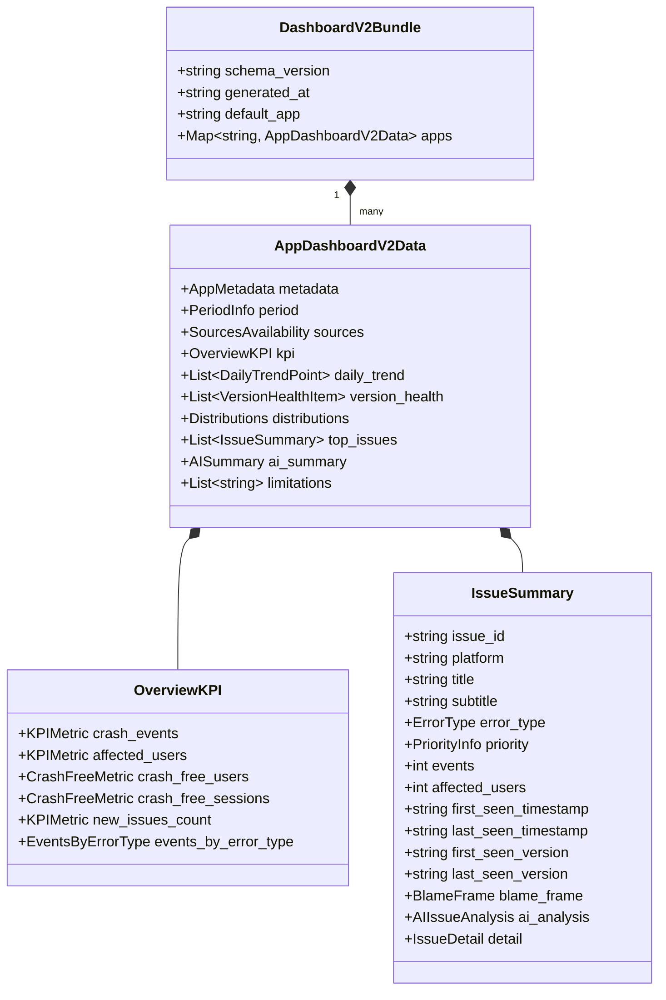

# Dashboard V2 Data Schema Specification

本文檔定義 **Crashlytics Engineering Dashboard V2** 的標準資料契約（Data Contract）。
本契約旨在解耦資料擷取（BigQuery、Sessions、MCP、Console）、AI 分析與前端 UI 顯示層，使後續子任務（#3～#8）能在明確的資料介面下平行開發。

---

## 1. 設計原則與核心概念

1. **前端與 Raw BigQuery 完全解耦**：
   UI 僅消費本 Schema 定義的聚合資料與結構化分析，不得直接解析 BigQuery raw JSON 或自行在前端執行重度聚合。
2. **多 App 與跨平台（Multi-App & Cross-Platform）一等支援**：
   原生支援包含 iOS / Android 雙平台或多 App 切換，具備平台特定過濾與全域彙總能力。
3. **正確的聚合語意與資料一致性（Accurate Aggregations & Consistency）**：
   - `crash_events`：期間內所有崩潰事件全量統計（`COUNT(*)`）。
   - `affected_users`：期間內去重受影響用戶（`COUNT(DISTINCT installation_uuid)`），**禁止跨 Issue 加總造成重複計數**。
   - `daily_trend` 一致性：`sum(daily_trend[i].crash_events) == kpi.crash_events.value`；`daily_trend[i].fatal_events + daily_trend[i].anr_events + daily_trend[i].non_fatal_events == daily_trend[i].crash_events`。
   - `affected_users` 在 daily trend 中為當日 distinct users，各日相加可能大於期間總 distinct users（正常現象）。
4. **顯式狀態與空值語意（Explicit Availability Semantics）**：
   對外部依賴（如 Firebase Sessions 導出、Gemini AI 分析）提供顯式的 `status`（`available` / `unavailable` / `disabled` / `error`）。當 Sessions 未啟用時，Crash-free 指標呈現 `unavailable`，**嚴禁顯示假 0% 或假 0**。
5. **嚴格時間戳規範（Strict ISO 8601 UTC Timestamps）**：
   所有時間戳一律使用標準 **ISO 8601 UTC** 字串（例：`2026-09-02T14:30:00Z`），必須以 `Z` 或 `+00:00` 結尾，且為真實有效之曆法時間。

---

## 2. 資料結構層次

Dashboard V2 資料包含兩個主要層次：
- **`DashboardV2Bundle`**（多 App 集合容器，供前端載入或 static dashboard 內嵌）
- **`AppDashboardV2Data`**（單一 App 完整資料核心）



---

## 3. 詳細欄位規格定義

### 3.1 容器與 Metadata

#### `DashboardV2Bundle`
| 欄位名稱 | 型別 | 必填 | 說明 | 範例 |
| :--- | :--- | :--- | :--- | :--- |
| `schema_version` | string | 是 | Schema 版本號，固定為 `"2.0"` | `"2.0"` |
| `generated_at` | string (ISO 8601 UTC) | 是 | 報表產生時間（UTC，結尾為 `Z`） | `"2026-09-02T14:00:00Z"` |
| `default_app` | string | 是 | 預設開啟的 App key | `"my_app"` |
| `apps` | object | 是 | Key 為 app ID，Value 為 `AppDashboardV2Data` | `{ "my_app": { ... } }` |

#### `AppMetadata`
| 欄位名稱 | 型別 | 必填 | 說明 | 範例 |
| :--- | :--- | :--- | :--- | :--- |
| `app_id` | string | 是 | 系統識別用唯一代號 | `"my_app"` |
| `display_name` | string | 是 | UI 顯示名稱 | `"My App (Taiwan)"` |
| `firebase_project_id` | string | 是 | Firebase 專案代碼 | `"my-app-prod-1234"` |
| `platforms` | array[string] | 是 | 支援之平台列表（`"ios"`, `"android"`） | `["ios", "android"]` |
| `source_repo` | string \| null | 是 (可為 null) | 本地/遠端原始碼路徑或 Git 網址 | `"~/projects/my_app"` |
| `custom_keys_monitored`| array[string] | 是 | 監控中自訂鍵值列表 | `["user_tier", "screen_name"]` |

#### `PeriodInfo`
| 欄位名稱 | 型別 | 必填 | 說明 | 範例 |
| :--- | :--- | :--- | :--- | :--- |
| `days` | integer | 是 | 統計回溯天數 | `30` |
| `start_time` | string (ISO 8601 UTC) | 是 | 區間開始時間（UTC） | `"2026-08-03T14:00:00Z"` |
| `end_time` | string (ISO 8601 UTC) | 是 | 區間結束時間（UTC） | `"2026-09-02T14:00:00Z"` |
| `comparison_period` | object \| null | 是 (可為 null) | 上期對比時間範圍資訊 | `{ "days": 30, "start_time": "...", "end_time": "..." }` |

---

### 3.2 資料來源狀態（Sources & Availability）

#### `SourcesAvailability`
記錄各外部數據管道的健康度與抓取狀態：
```json
{
  "crashlytics_bq": {
    "status": "available",
    "tables_queried": ["com_example_app_IOS", "com_example_app_ANDROID"],
    "last_sync_timestamp": "2026-09-02T14:00:00Z",
    "error_message": null
  },
  "firebase_sessions": {
    "status": "unavailable",
    "last_sync_timestamp": null,
    "error_message": "Firebase Sessions export table not found in dataset"
  },
  "mcp_crashlytics": {
    "status": "available",
    "last_sync_timestamp": "2026-09-02T14:05:00Z",
    "error_message": null
  },
  "gemini_ai": {
    "status": "available",
    "model": "gemini-flash-latest",
    "last_sync_timestamp": "2026-09-02T14:10:00Z",
    "error_message": null
  }
}
```
- `status` 取值：`"available"`（正常可用）、`"unavailable"`（未啟用/無數據）、`"disabled"`（手動關閉/未開啟）、`"error"`（查詢失敗）、`"stale"`（快取過期/使用備用快取中）、`"insufficient_data"`（資料量不足以計算）。
- V2.2 補充：可選欄位 `bundle.pipeline_run` 記錄最近一次管線健康狀態 (`out/pipeline_run.json`)。

---

### 3.3 總覽 KPI（Overview KPI）

#### `KPIMetric`（通用數值指標）
| 欄位名稱 | 型別 | 必填 | 說明 | 範例 |
| :--- | :--- | :--- | :--- | :--- |
| `value` | integer | 是 | 當期計數 | `12450` |
| `previous_value` | integer \| null | 是 (可為 null) | 上期計數（無基期則為 `null`） | `15600` |
| `change_pct` | float \| null | 是 (可為 null) | 變化百分比（%）（例：-20.19 代表下降 20.19%） | `-20.19` |
| `status` | string | 是 | 狀態（`"available"`, `"insufficient_data"`, `"error"`） | `"available"` |

#### `CrashFreeMetric`（Crash-free 率指標，由 Firebase Sessions 提供）
| 欄位名稱 | 型別 | 必填 | 說明 | 範例 |
| :--- | :--- | :--- | :--- | :--- |
| `rate` | float \| null | 是 (可為 null) | Crash-free 比率（**0.0 ～ 1.0**，例如 0.9985 代表 99.85%） | `0.9985` |
| `total` | integer \| null | 是 (可為 null) | 總數（總用戶數或總 Session 數） | `500000` |
| `crashed` | integer \| null | 是 (可為 null) | 崩潰數（崩潰用戶數或崩潰 Session 數） | `750` |
| `previous_rate` | float \| null | 是 (可為 null) | 上期 Crash-free 比率 | `0.9972` |
| `change_pct_points`| float \| null | 是 (可為 null) | 百分點變化（例：`+0.13` 代表提高 0.13%） | `0.13` |
| `status` | string | 是 | `"available"` \| `"unavailable"` \| `"insufficient_data"` \| `"error"` | `"available"` |
| `unavailable_reason` | string \| null | 是 (可為 null) | 若為 `unavailable` 時的原因說明 | `"Firebase Sessions export 未開啟"` |

#### `EventsByErrorType`
| 欄位名稱 | 型別 | 必填 | 說明 | 範例 |
| :--- | :--- | :--- | :--- | :--- |
| `fatal` | integer | 是 | 致命閃退（FATAL）事件數 | `8200` |
| `anr` | integer | 是 | 應用程式無回應（ANR）事件數 | `1350` |
| `non_fatal` | integer | 是 | 捕捉記錄之非致命錯誤事件數 | `2900` |

---

### 3.4 每日趨勢（Daily Trend）

`daily_trend` 為陣列，依日期由舊至新升冪排序（`date: YYYY-MM-DD`），天數長度應涵蓋 `period.days`。
```json
{
  "date": "2026-09-01",
  "crash_events": 412,
  "affected_users": 285,
  "fatal_events": 270,
  "anr_events": 42,
  "non_fatal_events": 100,
  "sessions_total": 24500,
  "crashed_sessions": 38,
  "crash_free_sessions_rate": 0.9984,
  "by_platform": {
    "ios": { "events": 180, "users": 120 },
    "android": { "events": 232, "users": 165 }
  }
}
```

---

### 3.5 版本健康度（Version Health）

`version_health` 陣列呈現各主要活躍版本的指標，按版本號降冪或活躍度排序：
| 欄位名稱 | 型別 | 必填 | 說明 | 範例 |
| :--- | :--- | :--- | :--- | :--- |
| `version` | string | 是 | 應用程式版本字串 | `"3.2.0"` |
| `platform` | string | 是 | `"ios"` \| `"android"` \| `"all"` | `"all"` |
| `release_date` | string \| null | 是 (可為 null) | 發布日期（YYYY-MM-DD） | `"2026-08-20"` |
| `crash_events` | integer | 是 | 該版本在此期間的崩潰事件數 | `1250` |
| `affected_users` | integer | 是 | 該版本在此期間受影響用戶數 | `820` |
| `crash_free_users_rate` | float \| null | 是 (可為 null) | 該版本 Crash-free 用戶率（若有 Sessions） | `0.9991` |
| `crash_free_sessions_rate`| float \| null | 是 (可為 null) | 該版本 Crash-free Sessions 率 | `0.9994` |
| `adoption_rate` | float \| null | 是 (可為 null) | 該版本佔總活躍 Session / User 佔比（0.0～1.0） | `0.65` |
| `status` | string | 是 | `"latest"` \| `"active"` \| `"maintenance"` \| `"deprecated"` | `"latest"` |
| `trend` | string | 是 | `"improving"` \| `"degrading"` \| `"stable"` \| `"new"` | `"stable"` |

---

### 3.6 維度分布（Distributions）

```json
{
  "platform": [
    { "name": "android", "events": 7200, "users": 4800, "share": 0.578 },
    { "name": "ios", "events": 5250, "users": 3500, "share": 0.422 }
  ],
  "device_models": [
    { "model": "iPhone 15 Pro", "platform": "ios", "events": 1200, "users": 800, "share": 0.096 },
    { "model": "Samsung Galaxy S24", "platform": "android", "events": 980, "users": 650, "share": 0.078 }
  ],
  "os_versions": [
    { "os_version": "iOS 18.0.1", "platform": "ios", "events": 3100, "users": 2100, "share": 0.249 },
    { "os_version": "Android 14", "platform": "android", "events": 4500, "users": 3000, "share": 0.361 }
  ],
  "app_versions": [
    { "app_version": "3.2.0", "platform": "all", "events": 6800, "users": 4300, "share": 0.546 },
    { "app_version": "3.1.2", "platform": "all", "events": 4100, "users": 2800, "share": 0.329 }
  ],
  "custom_keys": [
    { "key": "user_tier", "value": "vip", "platform": "all", "events": 3200 }
  ]
}
```

---

### 3.7 Top Issues 與 Issue Detail

#### `IssueSummary`
| 欄位名稱 | 型別 | 必填 | 說明 | 範例 |
| :--- | :--- | :--- | :--- | :--- |
| `issue_id` | string | 是 | Crashlytics Issue ID | `"8a7f1b2c"` |
| `platform` | string | 是 | `"ios"` \| `"android"` | `"android"` |
| `title` | string | 是 | 錯誤類型或崩潰主標題 | `"NullPointerException"` |
| `subtitle` | string | 是 | 發生位置描述或函式 | `"CheckoutActivity.kt:142"` |
| `error_type` | string | 是 | `"FATAL"` \| `"ANR"` \| `"NON_FATAL"` | `"FATAL"` |
| `priority` | PriorityInfo | 是 | 程式計算之優先級分數與等級 | 見下方 `PriorityInfo` |
| `events` | integer | 是 | 該 Issue 在期間內之事件總數 | `3420` |
| `affected_users` | integer | 是 | 該 Issue 在期間內受影響之用戶數 | `2100` |
| `first_seen_timestamp` | string (ISO 8601 UTC) | 是 | 該 Issue 首次出現時間戳 | `"2026-08-12T09:15:00Z"` |
| `last_seen_timestamp` | string (ISO 8601 UTC) | 是 | 該 Issue 最近出現時間戳 | `"2026-09-02T13:40:00Z"` |
| `first_seen_version` | string | 是 | 該 Issue 最早出現之版本 | `"3.1.0"` |
| `last_seen_version` | string | 是 | 該 Issue 最新出現之版本 | `"3.2.0"` |
| `version_distribution` | array[object] | 是 | 依版本細分之 events/users 列表 | `[{"version":"3.2.0","events":2800,"users":1700}]` |
| `blame_frame` | BlameFrame \| null | 是 (可為 null) | 元兇 Stack Frame 資訊 | 見下方 `BlameFrame` |
| `ai_analysis` | AIIssueAnalysis | 是 | AI 針對該 Issue 之分析摘要 | 見下方 `AIIssueAnalysis` |
| `detail` | IssueDetail \| null | 是 (可為 null) | 深度診斷資料（若有抓取） | 見下方 `IssueDetail` |

#### `PriorityInfo`
```json
{
  "score": 88,
  "level": "P0",
  "trend": "worsening",
  "score_breakdown": {
    "users_normalized": 10.0,
    "events_normalized": 8.5,
    "fatal_anr_boost": 2,
    "worsening_boost": 2,
    "latest_version_boost": 2,
    "core_path_boost": 3
  }
}
```

#### `BlameFrame`
```json
{
  "file": "app/src/main/java/com/example/CheckoutActivity.kt",
  "line": 142,
  "symbol": "com.example.CheckoutActivity.processPayment",
  "class_name": "com.example.CheckoutActivity",
  "method_name": "processPayment",
  "is_blame": true,
  "source_available": true
}
```

#### `AIIssueAnalysis`
```json
{
  "status": "available",
  "root_cause": "結帳流程中 userProfile 在特定網路延遲條件下尚未初始化即被呼叫導致 NPE。",
  "suggested_fix": "在呼叫 processPayment 前加入 profile 空值防護並補齊 fallback 提示。",
  "effort": "S",
  "confidence": "high",
  "reasoning_sources": ["stack_trace", "blame_frame", "version_concentration"]
}
```

#### `IssueDetail`
```json
{
  "stack_trace": "java.lang.NullPointerException: Attempt to invoke virtual method on a null object reference\n\tat com.example.CheckoutActivity.processPayment(CheckoutActivity.kt:142)\n\tat ...",
  "breadcrumbs": [
    {
      "timestamp": "2026-09-02T13:39:58Z",
      "category": "navigation",
      "message": "User entered /checkout",
      "level": "info"
    }
  ],
  "logs": [
    { "timestamp": "2026-09-02T13:39:59Z", "message": "[PaymentService] Initiating payment request" }
  ],
  "custom_keys": {
    "user_tier": "gold",
    "cart_items_count": 3
  },
  "top_devices": [
    { "model": "Pixel 8", "events": 1400 }
  ],
  "top_os": [
    { "os_version": "Android 14", "events": 2300 }
  ]
}
```

---

### 3.8 AI 策略摘要（AI Summary）

```json
{
  "status": "available",
  "model": "gemini-flash-latest",
  "generated_at": "2026-09-02T14:10:00Z",
  "overview": "本期整體閃退事件較上月下降 20.2%，然而 3.2.0 新版在結帳流程中引入 1 個高頻 P0 NPE 崩潰，影響約 2,100 位用戶。",
  "key_takeaways": [
    "P0: CheckoutActivity.kt:142 佔本期總閃退量 27.5%，建議立即發布 3.2.1 Hotfix",
    "Android 14 上的 ANR 集中在啟動階段 Database init，需評估非同步載入",
    "舊版本（< 3.1.0）崩潰持續收斂，整體 Crash-free rate 提升至 99.85%"
  ],
  "distribution_insights": "崩潰高度集中於 Android 平台（佔 58%）及 3.2.0 版本。iOS 平台表現穩定。",
  "recommended_actions": [
    { "priority": "P0", "issue_id": "8a7f1b2c", "action": "修復 CheckoutActivity 空值指標保護", "effort": "S" }
  ],
  "data_limitations": "Firebase Sessions 僅收集最近 30 天數據；部分 MCP stack trace 缺去符號化資訊。"
}
```

---

## 4. 空值、缺漏與停用欄位語意指引（Semantics Guide）

| 狀態名稱 | 指標表現 | UI 呈現規範 | 適用情境 |
| :--- | :--- | :--- | :--- |
| **`available`** | 具有合法數值（如 `0.9985`、`1250`） | 正常渲染數值與圖表 | 數據管道正常 |
| **`unavailable`** | 數值為 `null`，附帶 `unavailable_reason` | 顯示 `"Unavailable"` 或 `"—"`（附 Tooltip 說明原因），**禁止顯示 `0` 或 `0%`** | Firebase Sessions 未開啟、舊版本無資料 |
| **`disabled`** | 數值為 `null` | 隱藏該模組或呈現停用提示卡 | 未設定 `GEMINI_API_KEY`、關閉 AI 功能 |
| **`insufficient_data`** | 數值為 `null` 或預設值 | 顯示 `"資料收集未滿"` 或 `"無基期"` | 統計時間不足、無上期對比基準 |
| **`error`** | 數值為 `null`，附帶 `error_message` | 顯示警告標籤，但不中斷整體儀表板其他區塊 | 單一查詢逾時或權限不足 |

---

## 5. 後續子任務（#3～#8）整合指引

1. **#3 BigQuery Query V2**：
   - 產出 `kpi.crash_events`、`kpi.affected_users`、`kpi.events_by_error_type`、`daily_trend`、`distributions`、`top_issues`。
   - 保證 `first_seen_timestamp` 與 `last_seen_timestamp` 填入標準 ISO 8601 UTC 時間字串（以 `Z` 結尾）。
2. **#4 Firebase Sessions**：
   - 填入 `kpi.crash_free_users` 與 `kpi.crash_free_sessions`。
   - 若 Sessions table 不存在，將 `sources.firebase_sessions.status` 設為 `"unavailable"`，指標設為 `null`。
3. **#5 Issue Detail Data**：
   - 為 `top_issues` 填入 `blame_frame` 與 `detail`（`stack_trace`、`breadcrumbs`、`logs`、`custom_keys`）。
4. **#6 & #7 UI Shell & Charts**：
   - 僅讀取本 Schema 定義欄位，透過 `tests/fixtures/dashboard_v2.json` 即可完全獨立完成版面與圖表開發。
5. **#8 Priority & AI Integration**：
   - 根據本 Schema 計算 `priority.score` / `priority.level`，並呼叫 Gemini 產出 `ai_summary` 及各 Issue 的 `ai_analysis`。
